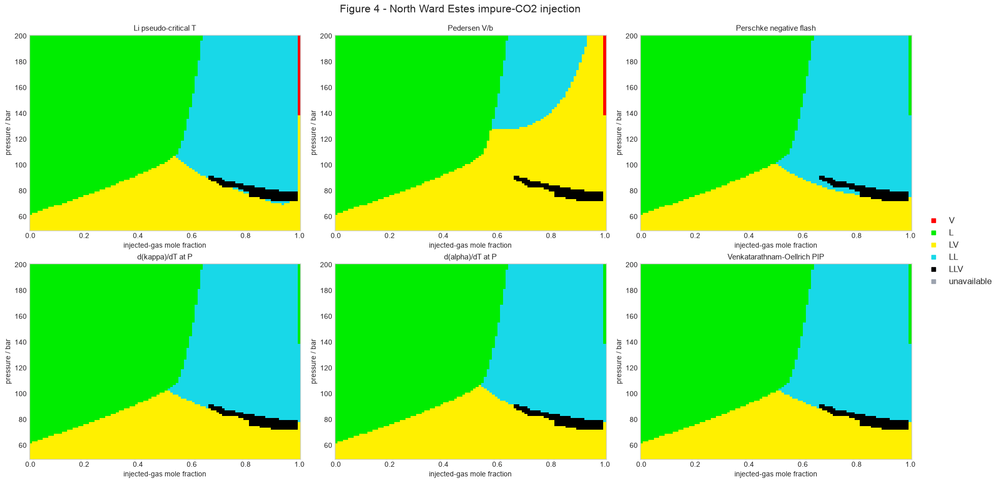

# Physical Phase Identification

Phase identification assigns a likely physical name—liquid or vapor—to an
already selected homogeneous state. It answers a different question from
equilibrium:

1. a root-selection operation supplies a molar volume \(V\);
2. a flash or stability calculation determines whether the state is an
   equilibrium phase; and
3. a phase-identification criterion labels that supplied state.

The label does not change the selected root, phase fraction, composition, or
phase count. In particular, a small identification residual is not a
stability test. For a flashed state, apply the criterion to each equilibrium
phase composition after checking convergence, fugacity equality, and material
balance.

`torch-flash` implements the five criteria compared by
[Bennett and Schmidt](https://doi.org/10.1021/acs.energyfuels.6b02316) and the
pressure-derivative parameter of
[Venkatarathnam and Oellrich](https://doi.org/10.1016/j.fluid.2010.12.001).
The implementation uses SI units and keeps the numerical criterion connected
to the PyTorch computation graph.

## State and derivative convention

Let

\[
P=P(T,V,\mathbf{x})
\]

be an explicit pressure equation for the supplied homogeneous composition
\(\mathbf{x}\). Composition is fixed in every derivative on this page. Define

\[
P_T=\left(\frac{\partial P}{\partial T}\right)_{V,\mathbf{x}},
\qquad
P_V=\left(\frac{\partial P}{\partial V}\right)_{T,\mathbf{x}},
\]

and similarly \(P_{TT}\), \(P_{VT}\), and \(P_{VV}\). A mechanically stable
homogeneous root satisfies

\[
V>0,\qquad P_V<0.
\]

Along an isobar, \(P(T,V(T),\mathbf{x})\) is constant. Its first total
derivative therefore gives

\[
0=P_T+P_V\dot V,
\qquad
\dot V\equiv
\left(\frac{\mathrm dV}{\mathrm dT}\right)_{P,\mathbf{x}}
=-\frac{P_T}{P_V}.
\]

Differentiating once more gives

\[
\ddot V\equiv
\left(\frac{\mathrm d^2V}{\mathrm dT^2}\right)_{P,\mathbf{x}}
=-
\frac{
P_{TT}+2P_{VT}\dot V+P_{VV}\dot V^2
}{P_V}.
\]

More generally, for any response \(F(T,V,\mathbf{x})\),

\[
\left(\frac{\mathrm dF}{\mathrm dT}\right)_{P,\mathbf{x}}
=F_T+F_V\dot V
=F_T-F_V\frac{P_T}{P_V}.
\]

These identities are the common calculation behind the two response
derivatives and the Venkatarathnam–Oellrich parameter.

## Li pseudo-critical temperature

The pseudo-critical mixing rule was proposed by
[Li (1971)](https://doi.org/10.1002/cjce.5450490529). It forms
volume-weighted component contributions

\[
w_i=x_iV_{c,i}
\]

and estimates the phase pseudo-critical temperature as

\[
T_{\mathrm{pc}}
=r_1
\frac{\sum_i w_iT_{c,i}}{\sum_i w_i}
=r_1
\frac{\sum_i x_iV_{c,i}T_{c,i}}
     {\sum_i x_iV_{c,i}}.
\]

Here \(T_{c,i}\) is in K, \(V_{c,i}\) is in
\(\mathrm{m^3\,mol^{-1}}\), and \(r_1\) is a dimensionless tuning factor.
`torch-flash` defaults to the value used in the comparison study,
\(r_1=1\). The dimensionless score and exact decision are

\[
q_{\mathrm{Li}}=\frac{T}{T_{\mathrm{pc}}},
\qquad
\begin{cases}
q_{\mathrm{Li}}>1 &: \text{vapor},\\
q_{\mathrm{Li}}\leq1 &: \text{liquid}.
\end{cases}
\]

This criterion has no explicit pressure term. Pressure can still affect a
post-flash label indirectly because the equilibrium phase composition
\(\mathbf{x}\) changes with pressure. The method is unavailable if the model
does not supply positive component critical volumes.

## Pedersen volume-to-covolume rule

The defining source for this diagnostic is the reservoir-fluid monograph by
[Pedersen and Christensen, first published in
2006](https://doi.org/10.1201/9781420018257), and retained in section 6.6 of
the [current edition](https://doi.org/10.1201/9780429457418). It is a
textbook criterion rather than a journal-paper proposal. The diagnostic
compares the cubic-EoS volume with the mixture covolume \(b\):

\[
q_{V/b}=\frac{V_{\mathrm{EOS}}}{b(\mathbf{x})}.
\]

For a conventional van der Waals one-fluid covolume,
\(b(\mathbf{x})=\sum_i x_i b_i\). `torch-flash` uses the exact mixture
covolume returned by the selected cubic model, so models with another
supported covolume mixing rule retain that definition. The volume is obtained
from the selected compressibility-factor root,

\[
V_{\mathrm{EOS}}=\frac{ZRT}{P}.
\]

Cubic volume translations are deliberately excluded from this ratio: the
criterion uses the volume associated with the repulsive cubic term and the
same \(b\), not a translated property volume. With the recommended default
\(r_2=1.75\),

\[
\begin{cases}
V_{\mathrm{EOS}}/b>r_2 &: \text{vapor},\\
V_{\mathrm{EOS}}/b\leq r_2 &: \text{liquid}.
\end{cases}
\]

The public `threshold` option exposes \(r_2\), so a non-default value is a
scientific model choice and should be recorded with the result. See
[Pedersen, Christensen, and Shaikh](https://doi.org/10.1201/9780429457418),
section 6.6, for the cubic-EoS rule used by default.

## Perschke negative-flash residual

The phase-label shortcut is attributed to
[Perschke's 1988 dissertation](#references). It uses the negative-flash
extension formalized by
[Whitson and Michelsen (1989)](https://doi.org/10.1016/0378-3812(89)80072-X)
and Wilson's 1968 equilibrium-ratio estimate. For the supplied composition,
define the two-phase Rachford–Rice function

\[
G(\beta)=
\sum_i
\frac{x_i(K_i-1)}
     {1+\beta(K_i-1)}.
\]

For positive \(K_i\) and admissible denominators,

\[
\frac{\mathrm dG}{\mathrm d\beta}
=-
\sum_i
\frac{x_i(K_i-1)^2}
     {\left[1+\beta(K_i-1)\right]^2}
\leq0,
\]

so \(G\) is monotone non-increasing. Perschke's shortcut evaluates the
function only at \(\beta=0.5\):

\[
G(0.5)=
\sum_i
\frac{x_i(K_i^{W}-1)}
     {1+0.5(K_i^{W}-1)}.
\]

The Wilson estimates used outside as well as inside the two-phase region are

\[
K_i^{W}
=\frac{P_{c,i}}{P}
\exp\left[
5.373(1+\omega_i)
\left(1-\frac{T_{c,i}}{T}\right)
\right].
\]

Because \(G\) decreases with \(\beta\), a positive \(G(0.5)\) places its root
above \(0.5\), while a negative value places it below \(0.5\). For a stable
homogeneous state, the negative-flash root is outside the physical interval
\((0,1)\), giving the \(>1\) vapor and \(<0\) liquid interpretation described
by Perschke. The implemented shortcut is

\[
\begin{cases}
G(0.5)>0 &: \text{vapor},\\
G(0.5)\leq0 &: \text{liquid}.
\end{cases}
\]

This is a homogeneous-state diagnostic constructed from an estimated
\(K\)-value correlation. It does not execute a negative flash, establish
stability, or replace the converged equilibrium ratios of a flash.

## Isothermal-compressibility derivative

The temperature-derivative criterion was proposed by
[Pasad and Venkatarathnam (1999)](https://doi.org/10.1021/ie980661t). The
isothermal compressibility is

\[
\kappa_T
=-\frac{1}{V}
\left(\frac{\partial V}{\partial P}\right)_{T,\mathbf{x}}
=-\frac{1}{VP_V},
\]

with units \(\mathrm{Pa^{-1}}\). Applying the constant-pressure chain rule
gives

\[
\left(\frac{\partial\kappa_T}{\partial T}\right)_{P,\mathbf{x}}
=
\frac{
VP_{VT}
-
\left(P_V+VP_{VV}\right)P_T/P_V
}{
\left(VP_V\right)^2
}.
\]

The same quantity can be evaluated without expanding the fraction:

\[
\left(\frac{\partial\kappa_T}{\partial T}\right)_{P,\mathbf{x}}
=
\left(\frac{\partial\kappa_T}{\partial T}\right)_{V,\mathbf{x}}
+
\left(\frac{\partial\kappa_T}{\partial V}\right)_{T,\mathbf{x}}
\dot V.
\]

`torch-flash` uses this second form with nested forward-mode
`torch.func.jvp` evaluations. It avoids finite-difference steps and preserves
the graph through \(T\), \(P\), composition, the selected molar volume, and
trainable model parameters. The criterion has units
\(\mathrm{Pa^{-1}\,K^{-1}}\):

\[
\begin{cases}
(\partial\kappa_T/\partial T)_P>0
    &: \text{liquid or liquid-like},\\
(\partial\kappa_T/\partial T)_P\leq0
    &: \text{vapor-like}.
\end{cases}
\]

## Thermal-expansion derivative

The thermal-expansion criterion was proposed by
[Bennett and Schmidt (2017)](https://doi.org/10.1021/acs.energyfuels.6b02316).
The isobaric thermal-expansion coefficient is

\[
\alpha_P
=\frac{1}{V}
\left(\frac{\partial V}{\partial T}\right)_{P,\mathbf{x}}
=\frac{\dot V}{V}
=-\frac{P_T}{VP_V},
\]

with units \(\mathrm{K^{-1}}\). Its constant-pressure temperature derivative
can be written either as a response chain rule,

\[
\left(\frac{\partial\alpha_P}{\partial T}\right)_{P,\mathbf{x}}
=
\left(\frac{\partial\alpha_P}{\partial T}\right)_{V,\mathbf{x}}
+
\left(\frac{\partial\alpha_P}{\partial V}\right)_{T,\mathbf{x}}
\dot V,
\]

or in terms of the first and second isobaric volume derivatives:

\[
\left(\frac{\partial\alpha_P}{\partial T}\right)_{P,\mathbf{x}}
=\frac{\ddot V}{V}
-\left(\frac{\dot V}{V}\right)^2.
\]

Substituting the pressure derivatives from the common calculation gives

\[
\left(\frac{\partial\alpha_P}{\partial T}\right)_{P,\mathbf{x}}
=-
\frac{
P_{TT}+2P_{VT}\dot V+P_{VV}\dot V^2
}{VP_V}
-\alpha_P^2.
\]

`torch-flash` again evaluates the response chain rule with nested forward-mode
JVPs. The score has units \(\mathrm{K^{-2}}\), and Bennett's decision is

\[
\begin{cases}
(\partial\alpha_P/\partial T)_P>0
    &: \text{liquid or liquid-like},\\
(\partial\alpha_P/\partial T)_P\leq0
    &: \text{vapor-like}.
\end{cases}
\]

## Venkatarathnam–Oellrich phase-identification parameter

The dimensionless parameter was proposed by
[Venkatarathnam and Oellrich (2011)](https://doi.org/10.1016/j.fluid.2010.12.001):

\[
\Pi
=V\left(
\frac{P_{VT}}{P_T}
-
\frac{P_{VV}}{P_V}
\right).
\]

The direct decision is

\[
\begin{cases}
\Pi>1 &: \text{liquid or liquid-like},\\
\Pi\leq1 &: \text{vapor-like}.
\end{cases}
\]

Its connection to the compressibility criterion follows immediately by
factoring the expanded derivative:

\[
\left(\frac{\partial\kappa_T}{\partial T}\right)_{P,\mathbf{x}}
=
\frac{P_T}{V^2P_V^2}(\Pi-1).
\]

Therefore, when \(P_T>0\), the two criteria have exactly the same sign and
decision boundary. If \(P_T<0\), the sign relation reverses; if \(P_T=0\),
\(\Pi\) is undefined. The published criterion assumes the conventional
positive-\(P_T\) states for which the equivalence is used.

The implementation evaluates \(P_T\), \(P_V\), \(P_{VT}\), and \(P_{VV}\)
with nested `torch.func.jvp` calls. For a leading state batch, every pressure
output depends only on the corresponding \(T,V,\mathbf{x}\) input. Directional
derivatives along all-one \(T\) or \(V\) tangents therefore recover the
independent Jacobian diagonals without constructing a dense batch Jacobian.

The calculation rejects \(P_V\geq0\) as mechanically unstable. It also guards
the two denominators using

\[
|P_T|\leq\tau|P/T|,
\qquad
|P_V|\leq\tau|P/V|,
\]

where \(\tau=\sqrt{\epsilon_{\mathrm{machine}}}\) by default. Through
`identify_phase`, a singular or mechanically unstable evaluation becomes an
ambiguous `unknown`, not an infinite score.

The local \(\Pi\) rule can identify some far-superheated states as
liquid-like after a high-temperature inversion. The source paper gives an
additional remote-temperature correction and notes that it is unnecessary
when the method labels saturated split phases after a converged flash.
`torch-flash` implements the local parameter and does not perform that remote
temperature search. For arbitrary superheated homogeneous states, interpret
the result as a local liquid-like/vapor-like diagnostic.

## Decision and ambiguity summary

| Public method name | Stored criterion | Threshold | Exact vapor decision |
|---|---:|---:|---|
| `li-pseudo-critical-temperature` | \(T/T_{\mathrm{pc}}\) | \(1\) | \(T/T_{\mathrm{pc}}>1\) |
| `pedersen-volume-to-covolume` | \(V_{\mathrm{EOS}}/b\) | \(1.75\) by default | \(V_{\mathrm{EOS}}/b>1.75\) |
| `perschke-negative-flash` | \(G(0.5)\) | \(0\) | \(G(0.5)>0\) |
| `pasad-isothermal-compressibility-derivative` | \((\partial\kappa_T/\partial T)_P\) | \(0\) | criterion \(\leq0\) |
| `bennett-thermal-expansion-derivative` | \((\partial\alpha_P/\partial T)_P\) | \(0\) | criterion \(\leq0\) |
| `venkatarathnam-oellrich-phase-identification-parameter` | \(\Pi\) | \(1\) | \(\Pi\leq1\) |

The exact inequality always determines `kind`. Separately, `ambiguous=True`
marks a score close to its separator. With relative tolerance \(r\), which
defaults to \(0.05\):

- Li and Pedersen use a symmetric log-ratio band,
  \(\left|\ln(q/q_*)\right|\leq\ln(1+r)\);
- Perschke scales the band by the sum of absolute Rachford–Rice terms;
- each response derivative scales the band by the sum of the absolute
  constant-pressure chain-rule terms; and
- the \(\Pi\) method uses \(|\Pi-1|\leq r\).

This flag exposes a numerically or physically weak label without silently
changing the exact literature decision.

## Minimal API example

The public API accepts one scalar \(T,P,\mathbf{x}\) state. The `phase`
argument selects the EoS root to evaluate; it is not the returned physical
identity:

```python
import torch

from torch_flash import (
    ChemicalState,
    PhaseIdentificationCriterion,
    component_set,
    configure,
    identify_phase,
    peng_robinson_1978,
)

configure(dtype=torch.float64, device="cpu", num_threads=1)
model = peng_robinson_1978(component_set(("methane", "n_butane")))
temperature = torch.tensor(250.0, requires_grad=True)
state = ChemicalState(
    temperature=temperature,
    pressure=torch.tensor(10.0e6),
    composition=torch.tensor([0.5, 0.5]),
)

methods: tuple[PhaseIdentificationCriterion, ...] = (
    "li-pseudo-critical-temperature",
    "pedersen-volume-to-covolume",
    "perschke-negative-flash",
    "pasad-isothermal-compressibility-derivative",
    "bennett-thermal-expansion-derivative",
    "venkatarathnam-oellrich-phase-identification-parameter",
)
results = {
    method: identify_phase(model, state, phase="stable", method=method)
    for method in methods
}

for method, result in results.items():
    value = None if result.criterion_value is None else result.criterion_value.detach()
    print(method, result.kind, value, result.ambiguous)

# Criterion tensors retain their graph; string labels do not.
pip = results["venkatarathnam-oellrich-phase-identification-parameter"]
d_pip_d_temperature = torch.autograd.grad(pip.criterion_value, temperature)[0]
```

At this state all six methods return an unambiguous liquid label. Always check
`criterion_value is not None` before differentiating a method that can be
unavailable. For an already flashed grid, use `identify_grid_phases`; the
[batched grid guide](../grid-flash.md) shows the complete equilibrium-first
workflow.

## Comparison on the North Ward Estes injection case

The following project-generated verification result was selected because a
\(100\times100\) grid resolves the narrow three-phase band while remaining
inexpensive enough to reproduce. It uses PR78 at \(301.48\ \mathrm{K}\), a
95 mol% CO2 + 5 mol% methane injection gas, and the seven-component North Ward
Estes oil data reported by
[Li and Firoozabadi](https://doi.org/10.2118/129844-PA). The plotted axes are
injected-gas mole fraction and pressure from 50 to 200 bar.



Every one of the 10,000 cells was flashed before applying each diagnostic to
the returned equilibrium phase compositions. All cells converged; the maximum
log-fugacity residual was \(9.9995\times10^{-9}\), the maximum
material-balance residual was \(6.7057\times10^{-14}\), and 141 cells were
three-phase. The published inputs omit component critical volumes, so
PR-consistent values were derived only for Li's labeling rule; they do not
enter the equilibrium flash.

The result is particularly informative because the methods agree on the broad
equilibrium topology but not on every physical label. Across valid cells, the
mean pairwise region-code agreement was 93.02%, the least-agreeing pair was
80.01%, and at least one method differed in 20.09% of cells. Pedersen's rule
produces the visibly largest injection-rich LV region. The \(\Pi\) and
\((\partial\kappa_T/\partial T)_P\) maps agree in all 10,000 cells, which
independently checks their algebraic equivalence for these mechanically stable
states.

The recorded float64 CPU wall times below are complete standalone method
passes over the same flashed phases; practical use normally selects one row,
not all six. The comparison ran with one PyTorch intra-op thread on the
recorded Apple-silicon host, so timings characterize this saved study rather
than other hardware.

| Method | Identification wall time |
|---|---:|
| Li pseudo-critical temperature | 1.543 ms |
| Pedersen \(V/b\) | 10.667 ms |
| Perschke negative flash | 2.236 ms |
| Venkatarathnam–Oellrich \(\Pi\) | 86.051 ms |
| Bennett \((\partial\alpha_P/\partial T)_P\) | 248.034 ms |
| Pasad/Venkatarathnam \((\partial\kappa_T/\partial T)_P\) | 252.771 ms |

This is verification of the implemented diagnostics and equilibrium workflow,
not validation against experimental phase labels or a pixel-wise
reconstruction of the paper's nominal \(500\times500\) raster. The complete
reproducible calculation, residual audits, timing environment, and all five
paper cases are in
[`29_bennett_phase_identification_methods`](https://github.com/ThermoPhase-FCSRG/torch-flash/blob/main/notebooks/verification/29_bennett_phase_identification_methods.ipynb).

## References

1. C. C. Li, “Critical Temperature Estimation for Simple Mixtures,”
   *Canadian Journal of Chemical Engineering* 49(5), 709–710 (1971).
   [doi:10.1002/cjce.5450490529](https://doi.org/10.1002/cjce.5450490529).
2. K. S. Pedersen and P. L. Christensen,
   *Phase Behavior of Petroleum Reservoir Fluids*, 1st ed., CRC Press (2006).
   [doi:10.1201/9781420018257](https://doi.org/10.1201/9781420018257).
3. K. S. Pedersen, P. L. Christensen, and J. A. Shaikh,
   *Phase Behavior of Petroleum Reservoir Fluids*, 3rd ed., CRC Press (2024),
   section 6.6.
   [doi:10.1201/9780429457418](https://doi.org/10.1201/9780429457418).
4. D. R. Perschke, “Development and Application of an Equation of State
   Compositional Simulator,” PhD dissertation, The University of Texas at
   Austin (1988).
5. D. R. Perschke, G. A. Pope, and K. Sepehrnoori, “Phase Identification
   During Compositional Simulation,” paper SPE-19442-MS, 64th SPE Annual
   Technical Conference and Exhibition, San Antonio, Texas (1989).
   [doi:10.2118/19442-MS](https://doi.org/10.2118/19442-MS).
6. C. H. Whitson and M. L. Michelsen, “The Negative Flash,”
   *Fluid Phase Equilibria* 53, 51–71 (1989).
   [doi:10.1016/0378-3812(89)80072-X](https://doi.org/10.1016/0378-3812(89)80072-X).
7. G. A. Wilson, “A Modified Redlich–Kwong Equation of State Applicable to
   General Physical Data Calculations,” paper 15C, 65th AIChE National
   Meeting, Cleveland, Ohio (1968).
8. G. V. Pasad and G. Venkatarathnam, “A Method for Avoiding Trivial Roots
   in Isothermal Flash Calculations Using Cubic Equations of State,”
   *Industrial & Engineering Chemistry Research* 38(9), 3530–3534 (1999).
   [doi:10.1021/ie980661t](https://doi.org/10.1021/ie980661t).
9. G. Venkatarathnam and L. R. Oellrich, “Identification of the Phase of a
   Fluid Using Partial Derivatives of Pressure, Volume and Temperature
   without Reference to Saturation Properties: Applications in Phase
   Equilibria Calculations,” *Fluid Phase Equilibria* 301, 225–233 (2011).
   [doi:10.1016/j.fluid.2010.12.001](https://doi.org/10.1016/j.fluid.2010.12.001).
10. J. Bennett and Z. Schmidt, “Comparison of Phase Identification Methods
   Used in Petroleum Reservoir Simulation,” *Energy & Fuels* 31, 3370–3379
   (2017).
   [doi:10.1021/acs.energyfuels.6b02316](https://doi.org/10.1021/acs.energyfuels.6b02316).
11. Z. Li and A. Firoozabadi, “General Strategy for Stability Testing and
    Phase-Split Calculation in Two and Three Phases,” *SPE Journal* 17(4),
    1096–1107 (2012).
    [doi:10.2118/129844-PA](https://doi.org/10.2118/129844-PA).
