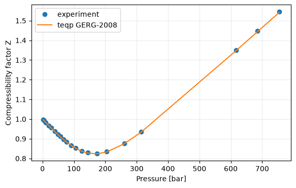
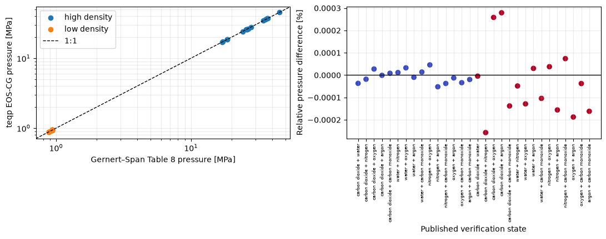

# GERG-2008 and EOS-CG

This report combines experimental validation of GERG-2008 compressibility
factors with equation verification of the six-component EOS-CG model. The
optional `teqp` path exercises the complete residual models; it crosses a
CPU/NumPy boundary and is not a differentiable native PyTorch calculation.

## GERG-2008 compressibility

The measured markers and model values cover the reported pressure series for
the nitrogen/methane/ethane/propane mixture. Agreement should be interpreted
within the printed precision of the source table.

## EOS-CG binary-state verification

The parity and residual panels cover the low- and high-density states for all
binary pairs among CO2, water, nitrogen, oxygen, argon, and carbon monoxide in
the published computer-program verification table. This is verification
against model-calculation values, not experimental validation.

Sources: [Kunz and Wagner (2012), GERG-2008](https://doi.org/10.1021/je300655b);
[Pedersen, Christensen, and Shaikh (2024), Table 7.20](https://doi.org/10.1201/9780429457418);
and [Gernert and Span (2016), EOS-CG Table 8](https://doi.org/10.1016/j.jct.2015.05.015).
