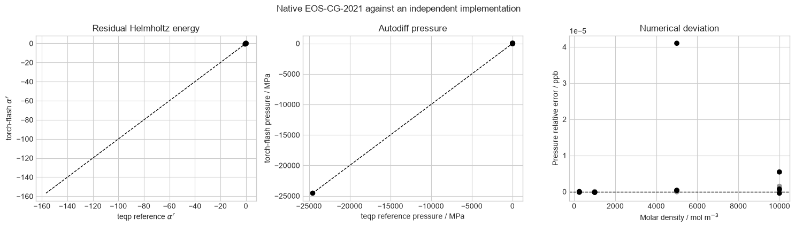
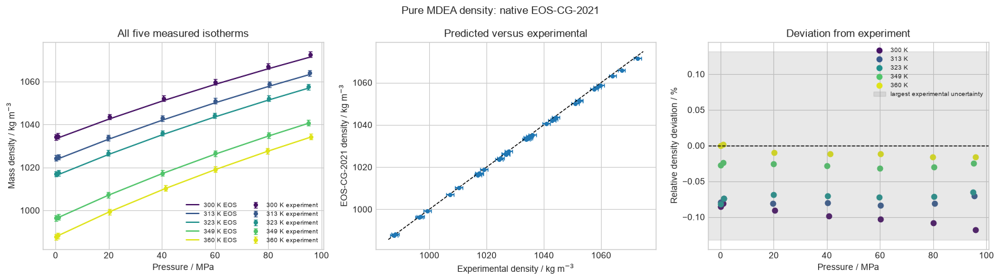
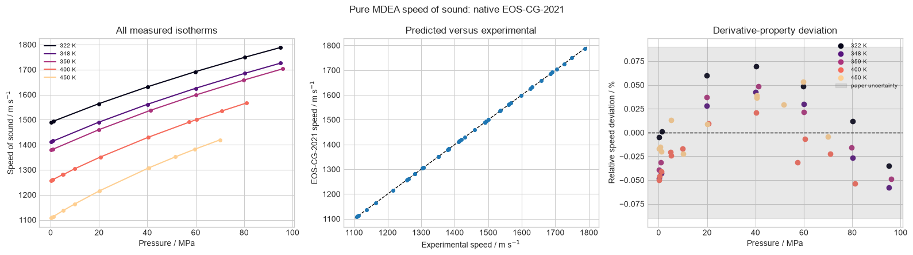

# Native EOS-CG-2021

The native PyTorch EOS-CG-2021 implementation is checked against an
independently generated dense-mixture reference and against pure-MDEA liquid
measurements. No MDEA parameter is fitted in this study.

## Dense CO2/H2 verification

The plots compare residual Helmholtz energy, pressure, and pressure residuals
over the saved composition, temperature, and density grid. Because the
reference was generated with `teqp`, this panel verifies the native
implementation rather than validating physical accuracy.

## MDEA liquid density

The temperature-resolved property curves, parity panel, and relative
deviations compare the native model with the full openly licensed density
dataset.

## MDEA speed of sound

Speed of sound exercises the ideal and residual Helmholtz terms together with
first and second temperature/density derivatives. The displayed agreement is
specific to pure MDEA over the measured range and is not a universal
EOS-CG-2021 accuracy claim.

Sources: [Thol et al. (2023), EOS-CG-2021](https://doi.org/10.1007/s10765-023-03263-6)
and [Neumann et al. (2022), MDEA measurements](https://doi.org/10.1007/s10765-021-02933-7),
licensed [CC BY 4.0](https://creativecommons.org/licenses/by/4.0/).
