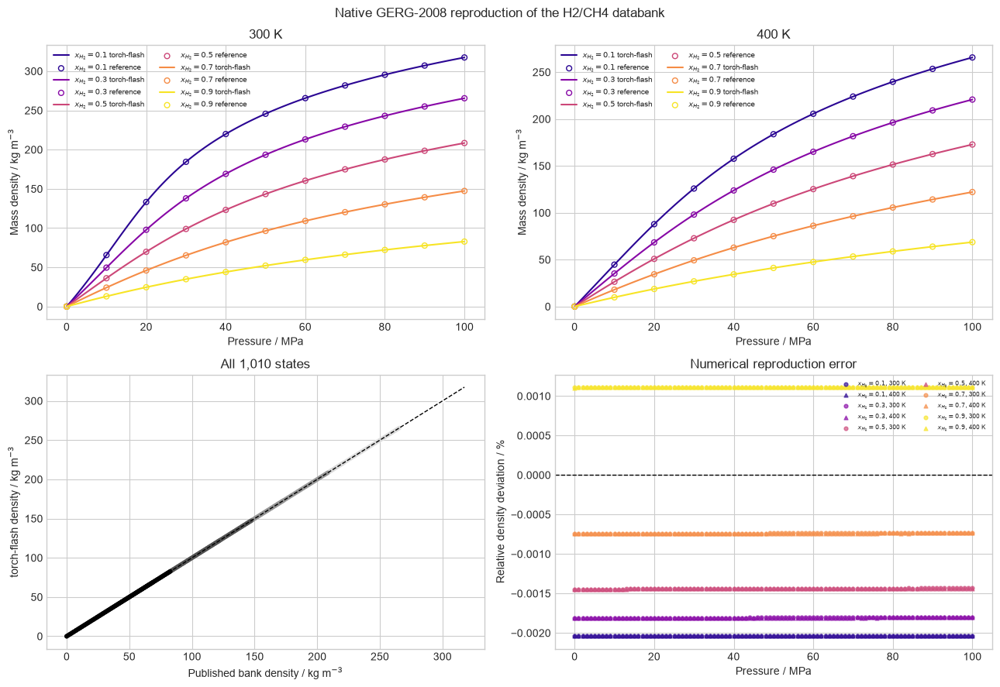
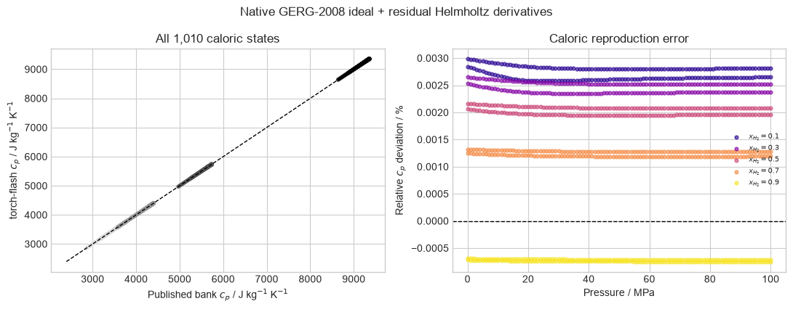

# Native GERG-2008 for H2/CH4

The native PyTorch GERG-2008 implementation is verified against the complete
1,010-state H2/CH4 model-generated databank. The saved reference covers five
hydrogen compositions, two temperatures, and pressures from 0.01 to 100 MPa.

## Density

Every state is included in the parity and deviation panels. Reference markers
are thinned only on the property curves to keep the individual composition
series legible.

## Isobaric heat capacity

This derivative-property comparison exercises the ideal and residual
Helmholtz terms together. Because the databank was itself generated with
GERG-2008, both panels are equation verification rather than experimental
validation.

Sources: [Kunz and Wagner (2012), GERG-2008](https://doi.org/10.1021/je300655b)
and the [H2ThermoBank dataset](https://doi.org/10.6084/m9.figshare.12063297),
licensed [CC BY 4.0](https://creativecommons.org/licenses/by/4.0/).
