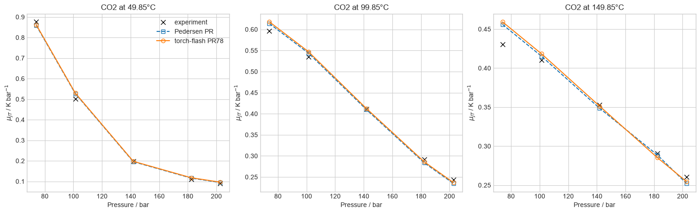
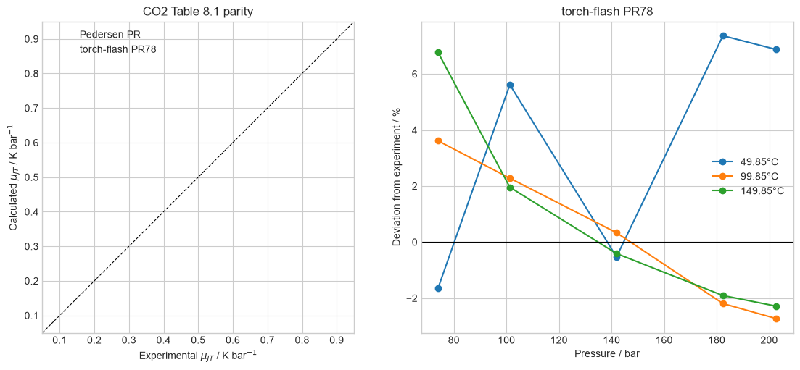
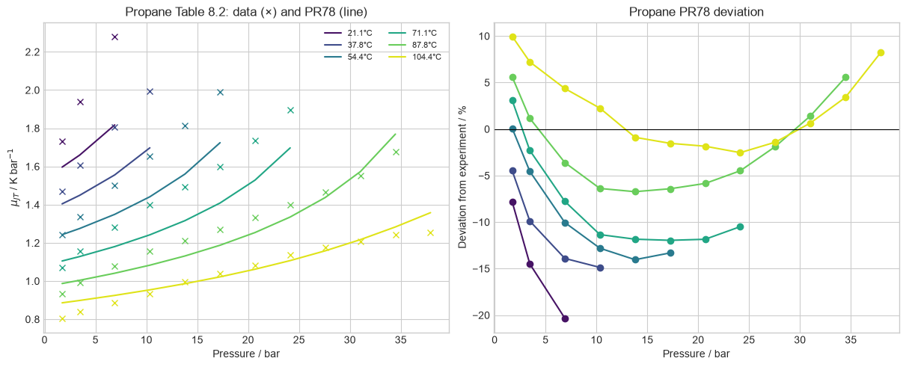
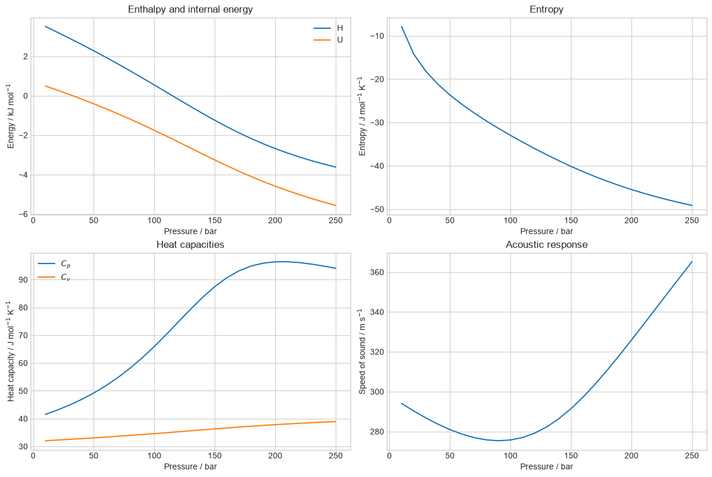

# Autodifferentiated thermal properties

This study obtains homogeneous-state thermal properties from the implemented
thermodynamic potential with PyTorch autodiff. The experimental comparisons
focus on the Joule-Thomson coefficient; the final figure demonstrates the
other available properties without treating them as additional validation
data.

## CO2 Joule-Thomson coefficient

The first comparison separates experiment, the independently reported
Peng-Robinson calculation, and `torch-flash`. The parity and signed-error
panels make the pressure-dependent discrepancy visible.

## Propane Joule-Thomson coefficient

The propane curves follow the experimental vapor branch over all reported
isotherms. Explicit vapor-root selection avoids switching to a liquid or
metastable branch during numerical differentiation.

## Homogeneous-state property profiles

These profiles demonstrate enthalpy, internal energy, entropy, heat
capacities, Joule-Thomson coefficient, and speed of sound from supplied
homogeneous states. Additive enthalpy and entropy reference choices do not
affect the derivative properties.

Sources: [Pedersen, Christensen, and Shaikh (2024), Chapter 8](https://doi.org/10.1201/9780429457418);
[Wang, Wang, and Sun (2017), CO2 measurements](https://doi.org/10.1016/j.jcou.2017.04.007);
and [Sage, Kennedy, and Lacey (1936), propane measurements](https://doi.org/10.1021/ie50317a026).
