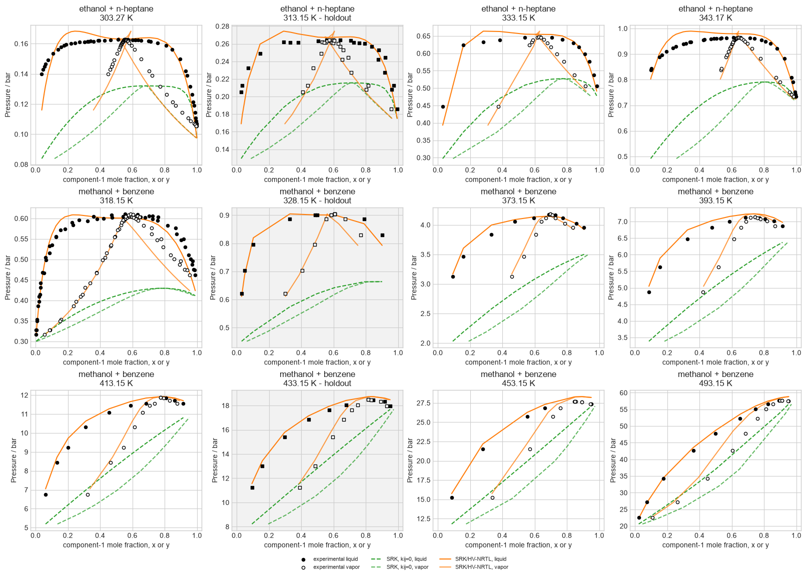
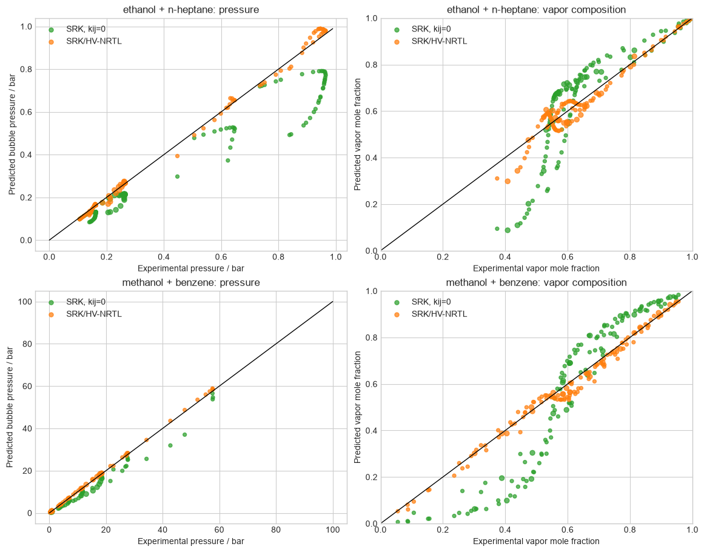
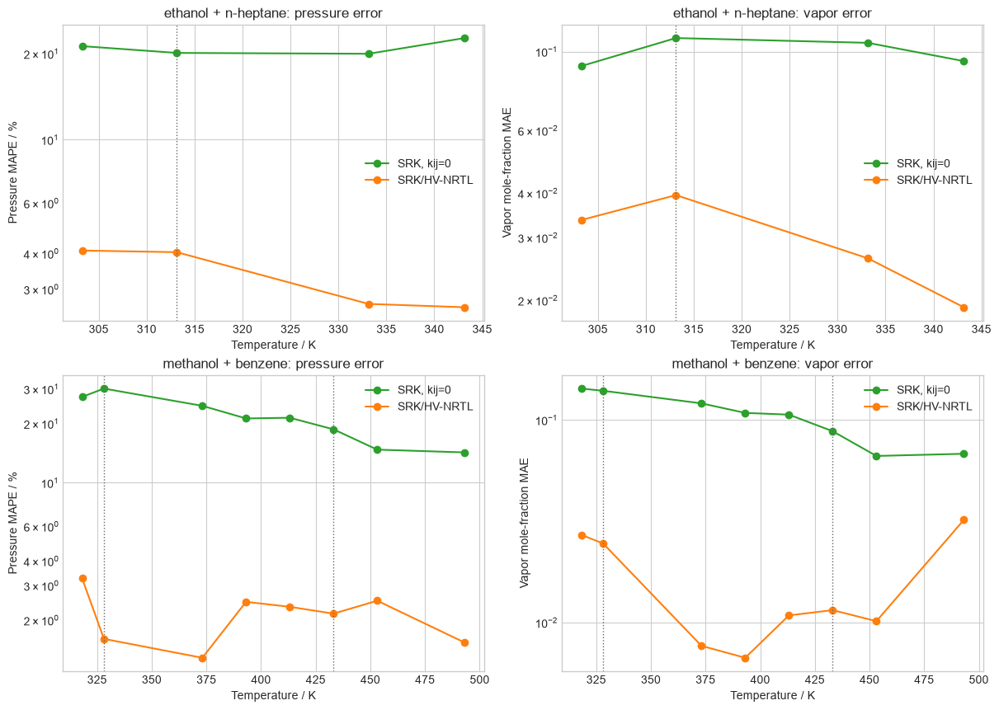

# Huron-Vidal mixing

SRK with Huron-Vidal/NRTL mixing is evaluated for ethanol/n-heptane and
methanol/benzene. Complete isotherms are held out before fitting, so the gray
panels and holdout symbols test temperature transfer rather than random
point-wise interpolation.

## Complete phase diagrams

Filled and open experimental markers distinguish liquid and vapor
compositions. The model curves are bubble solutions evaluated at the measured
liquid compositions; equal-composition azeotropic states are retained.

## Parity and temperature transfer

Pressure and vapor-composition panels are shown separately because an
improvement in one observable can conceal deterioration in the other. The
temperature-resolved view also exposes system-specific transfer behavior.
These are binary-specific fitted parameters, not predictive
group-contribution parameters.

Sources: [Huron and Vidal (1979)](https://doi.org/10.1016/0378-3812%2879%2980001-1);
[Jaubert et al. (2020), reviewed binary collection](https://doi.org/10.1021/acs.iecr.0c01734);
[Berro et al. (1982)](https://doi.org/10.1016/0378-3812%2882%2980005-8);
[Ratcliff and Chao (1969)](https://doi.org/10.1002/cjce.5450470208);
[Toghiani et al. (1994)](https://doi.org/10.1021/je00013a018);
and [Strubl et al. (1972)](https://doi.org/10.1135/cccc19723522).
