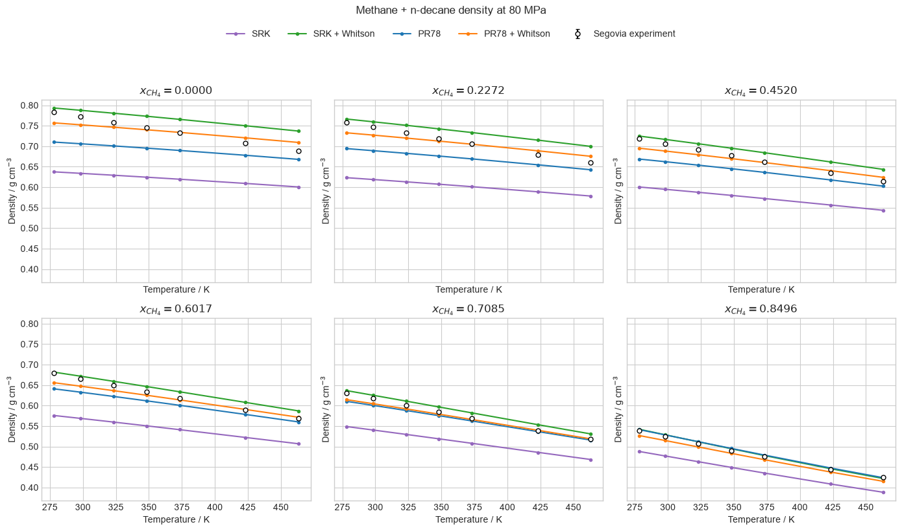
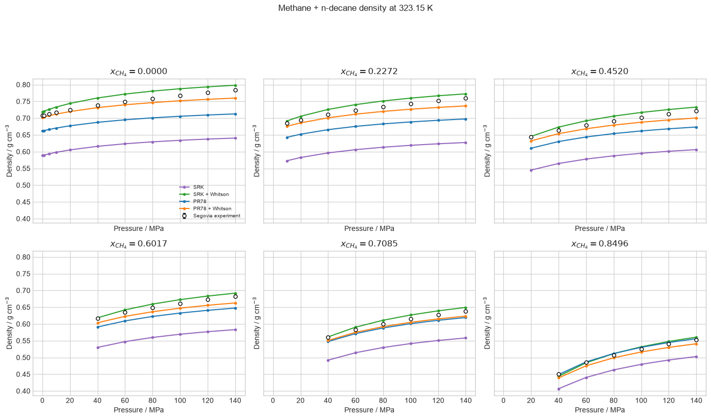
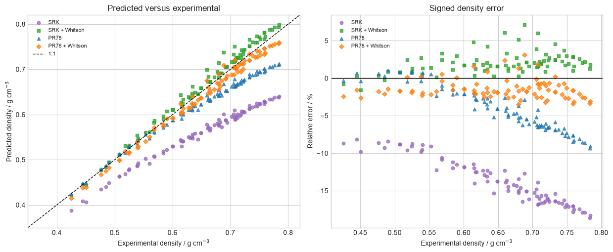

# Cubic volume translation

The study separates a Péneloux-style physical-volume mapping from the parent
SRK and PR78 equilibrium equations. It checks translation sign and
thermodynamic identities in the notebook, then compares untranslated and
translated liquid densities with methane/n-decane measurements.

## Density curves

Experimental markers include uncertainty bars where they are visible at the
plot scale. Model curves connect calculations along the reported experimental
state coordinates and should not be interpreted as additional measurements.

## Parity and signed error

The parity and residual panels show the volumetric effect independently of the
notebook's pressure, fugacity, residual-Helmholtz, and constant-translation
phase-equilibrium identity checks. Agreement is specific to these model,
translation, and mixture choices.

Sources: [Péneloux, Rauzy, and Fréze (1982)](https://doi.org/10.1016/0378-3812%2882%2980002-2);
[Pedersen, Christensen, and Shaikh (2024)](https://doi.org/10.1201/9780429457418);
Whitson and Brulé, *Phase Behavior*, SPE Monograph 20 (2000); and
[Segovia et al. (2017)](https://doi.org/10.1016/j.jct.2017.01.022).
