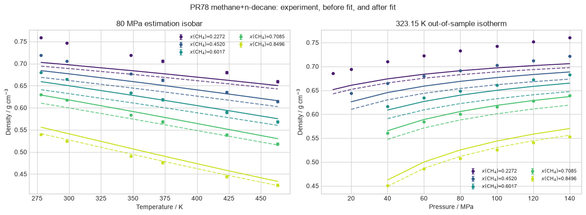
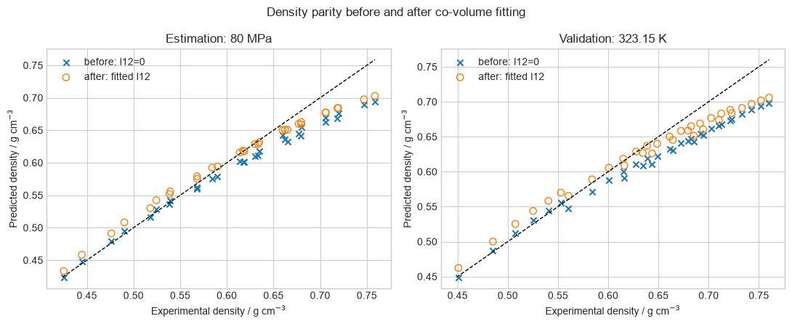
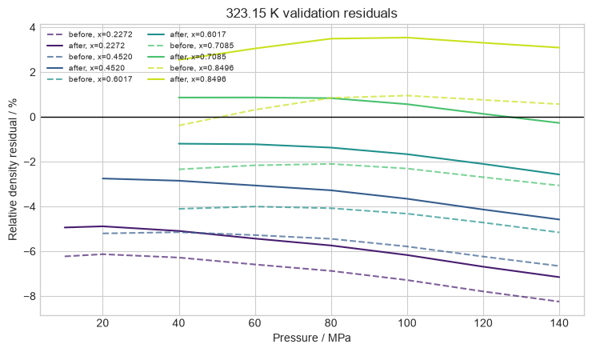
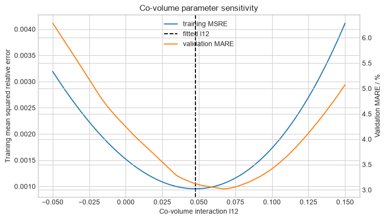

# Cross-co-volume interaction

This report studies the PR78 cross-co-volume parameter \(l_{12}\), which
changes the repulsive mixing rule and therefore is not a volume translation.
Only \(l_{12}\) is fitted on the estimation isobar; the constant-temperature
isotherm is disjoint validation data.

## Before and after fitting

Dashed curves and crosses identify the zero-interaction model; solid curves
and open markers identify the fitted interaction. The transfer from the
estimation isobar to the held-out isotherm is visible rather than represented
only by a pooled score.

## Validation residuals and sensitivity

The residual plot exposes pressure and composition structure on the held-out
isotherm. The sensitivity plot compares the estimation objective with
validation error over a wider parameter interval. It does not establish that
one constant transfers to other component families or equilibrium regimes.

Sources: [Privat and Jaubert (2023)](https://doi.org/10.1016/j.fluid.2022.113697);
[Pedersen, Christensen, and Shaikh (2024)](https://doi.org/10.1201/9780429457418);
and [Segovia et al. (2017)](https://doi.org/10.1016/j.jct.2017.01.022).
