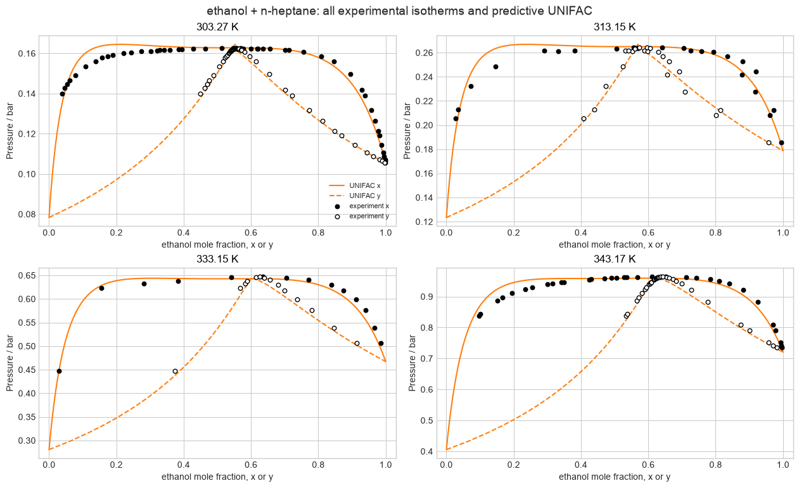
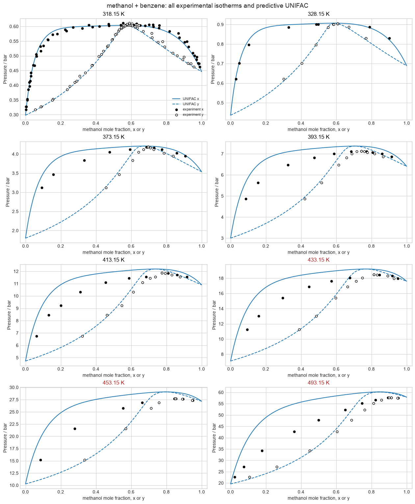
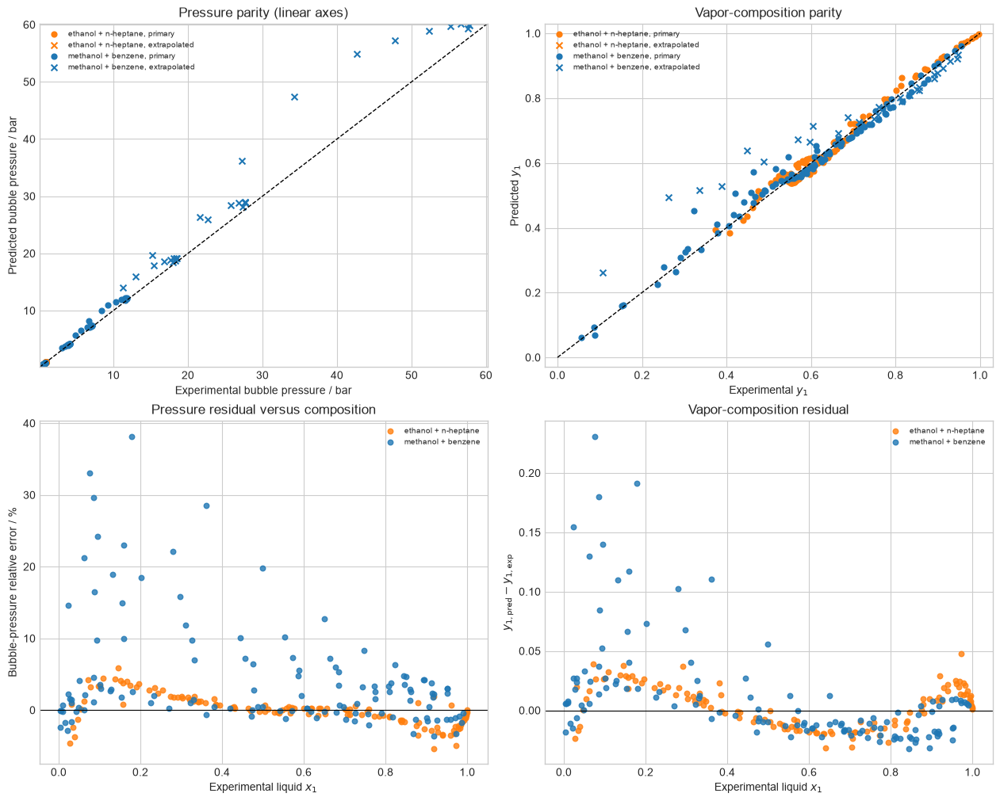
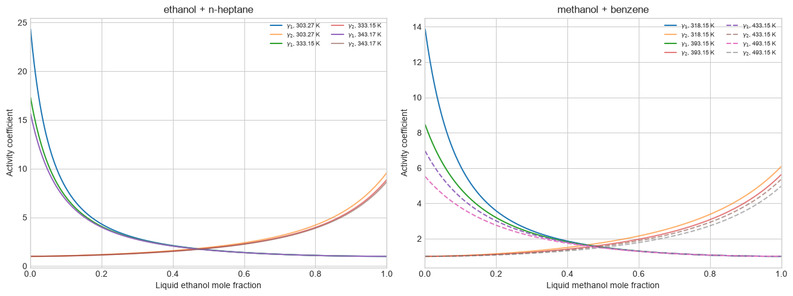

# Original UNIFAC

The native original-UNIFAC implementation predicts the two displayed binary
systems without fitting their observations. The phase-equilibrium comparison
uses a low-pressure activity-coefficient/ideal-vapor formulation; the hottest
states are visibly marked as extrapolative.

## Predictive phase diagrams

Solid and dashed model branches distinguish liquid and vapor compositions;
filled and open markers have the corresponding experimental meaning.
High-temperature panels are retained rather than silently excluded, but their
deviations also include the ideal-vapor approximation.

## Parity, residuals, and model surfaces

The parity and residual panels separate pressure from vapor composition and
distinguish the primary range from extrapolation. The activity-coefficient
surfaces show the liquid property driving the phase calculation. Independent
worked-state, excess-Gibbs autodiff, and Gibbs-Duhem checks remain verification
evidence in the notebook.

Sources: [Fredenslund, Jones, and Prausnitz (1975)](https://doi.org/10.1002/aic.690210607);
[Hansen et al. (1991)](https://doi.org/10.1021/ie00058a017);
the [DDBST original-UNIFAC parameter table](https://www.ddbst.com/published-parameters-unifac.html);
and [Jaubert et al. (2020)](https://doi.org/10.1021/acs.iecr.0c01734).
