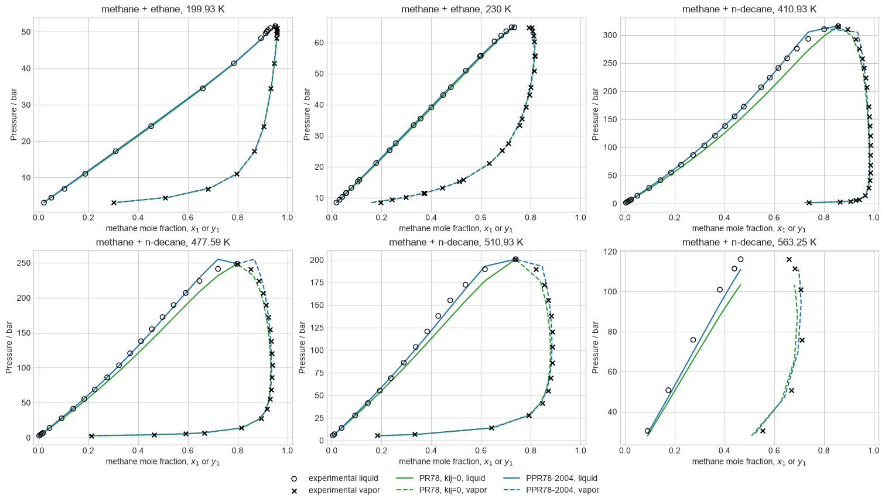
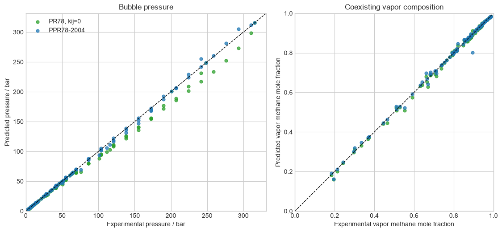
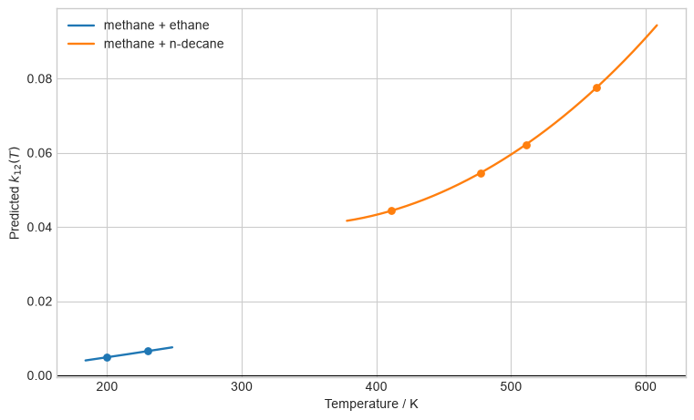

# Predictive Peng-Robinson 1978

Predictive PR78 and zero-interaction PR78 use identical pure-component
constants; their difference is the temperature-dependent group-contribution
interaction. No coefficient is refitted in this notebook, but the evaluated
systems contributed to the original global regression. The evidence is
therefore calibration-domain validation, not a blind prediction.

## Hydrocarbon phase diagrams

Open circles and black crosses identify measured liquid and vapor branches.
Solid and dashed colored curves show the corresponding predictions at the
measured liquid-composition grid.

## Property parity

Pressure and vapor composition are shown separately. This prevents a pressure
improvement from hiding a compensating phase-composition error near
coalescing branches.

## Predictive interactions

The interaction curves come from the published universal group coefficients,
not a binary-specific value recovered from the displayed experimental data.
The demonstrated scope does not establish transfer to polar, associating, or
unrepresented functional groups.

Sources: [Jaubert and Mutelet (2004)](https://doi.org/10.1016/j.fluid.2004.06.059);
[Jaubert et al. (2020)](https://doi.org/10.1021/acs.iecr.0c01734);
[Wichterle and Kobayashi (1972)](https://doi.org/10.1021/je60052a022);
and [Wei et al. (1995)](https://doi.org/10.1021/je00020a002).
