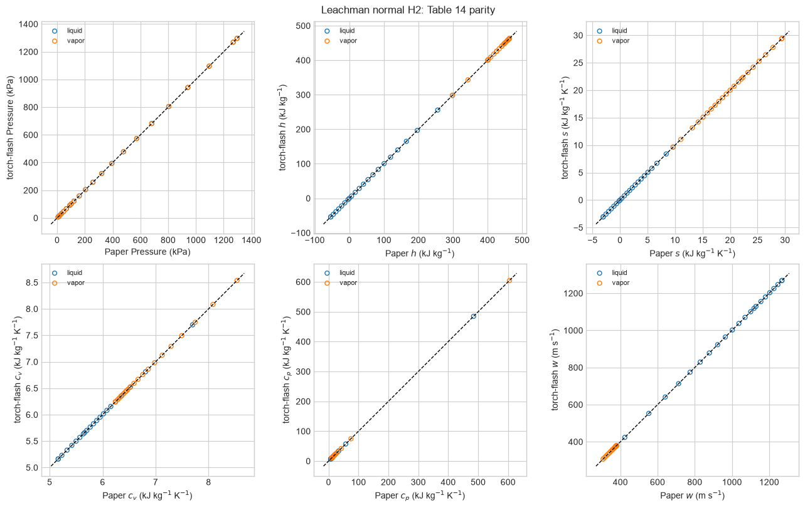
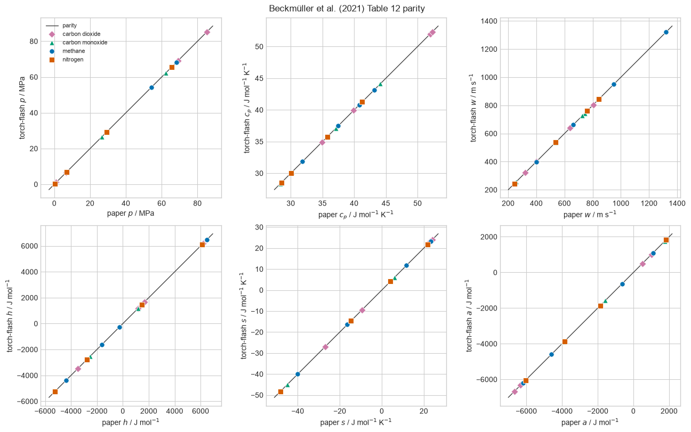
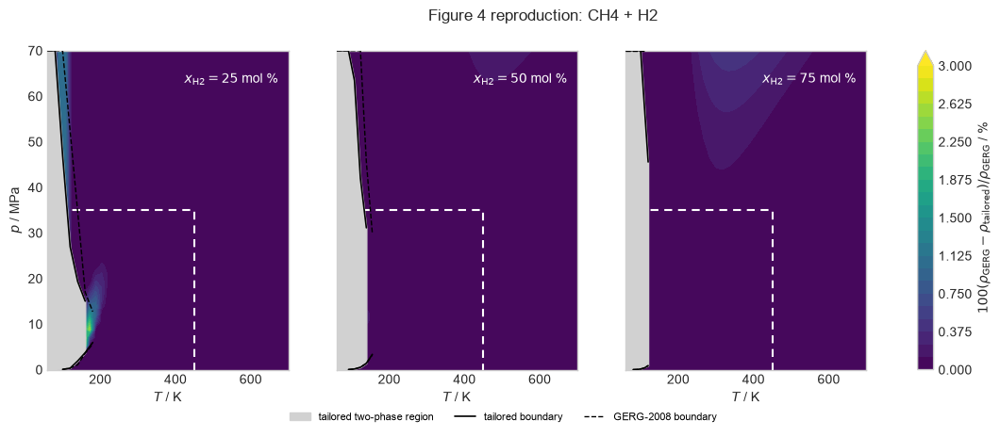
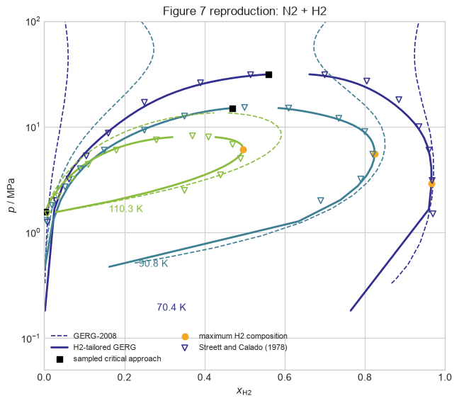
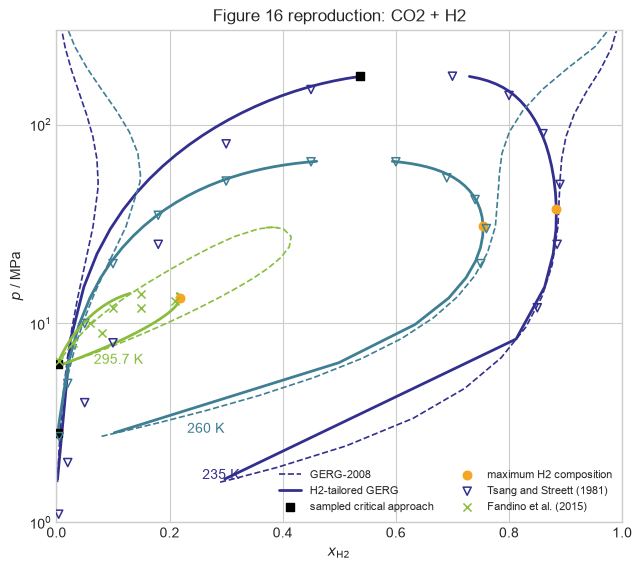

# Leachman normal H2 and H2-tailored GERG

This report combines verification of the normal-hydrogen pure-fluid equation
from J. W. Leachman et al., “Fundamental Equations of State for Parahydrogen,
Normal Hydrogen, and Orthohydrogen,” *Journal of Physical and Chemical
Reference Data* **38** (2009), 721–748,
[doi:10.1063/1.3160306](https://doi.org/10.1063/1.3160306), with reproduction
of selected mixture results from R. Beckmüller et al., “New Equations of State
for Binary Hydrogen Mixtures Containing Methane, Nitrogen, Carbon Monoxide,
and Carbon Dioxide,” *Journal of Physical and Chemical Reference Data* **50**
(2021), 013102,
[doi:10.1063/5.0040533](https://doi.org/10.1063/5.0040533).

The pure-fluid study checks the normal-H2 ideal and residual Helmholtz
inventories and the complete saturation-property grid reported by Leachman et
al. The mixture study reproduces Beckmüller et al. Table 12 and Figures 4, 7,
and 16. Together, these studies verify the normal-H2 reference equation first
and then its use inside the H2-tailored multifluid model.

The implementation uses the article's main five-component parameterization:
GERG-2008 pure-fluid equations for CH4, N2, CO, and CO2; the Leachman equation
for normal hydrogen; and the published binary reducing and departure
parameters. The supplementary parameterization based on newer reference
equations is a distinct model and is not substituted here.

## Leachman normal-H2 pure-fluid verification

All 14 residual terms, the ideal-gas coefficients, the equation gas constant,
and the fixed critical properties match the defining paper. Across the 23
normal-H2 saturation states, the maximum absolute differences are 0.0078
kJ/kg for enthalpy, 0.00063 kJ/(kg K) for entropy, 0.00010 kJ/(kg K) for
isochoric heat capacity, 0.066 kJ/(kg K) for isobaric heat capacity, and 0.060
m/s for speed of sound. The largest isobaric-heat-capacity difference occurs
near the critical point and is \(1.36\times10^{-4}\) in relative terms.

The printed liquid densities are strongly pressure-conditioned near the
triple point. Solving the reported temperature-pressure states instead
reproduces both phase densities within 0.0027 kg/m³ through 32 K and within
0.020 kg/m³ at 33 K. The maximum liquid-vapor Gibbs-energy difference at the
printed states is 0.015 J/mol.

## Table 12 implementation verification

All 16 states and all six reported properties are shown: pressure, isobaric
heat capacity, speed of sound, enthalpy, entropy, and molar Helmholtz energy.
This is verification against published model-calculation values.

## Figure 4: CH4/H2 density difference

The contours compare GERG-2008 with the H2-tailored parameterization at 25,
50, and 75 mol % H2. The shaded regions and boundary curves are calculated
phase-equilibrium results rather than experimental observations.

## Figure 7: N2/H2 phase equilibrium

The native H2-tailored and GERG-2008 traces are shown at 70.4, 90.8, and
110.3 K together with visually digitized experimental markers.

## Figure 16: CO2/H2 phase equilibrium

The corresponding CO2/H2 comparison covers 235, 260, and 295.7 K. The VLE
markers were visually digitized from the paper because numerical phase-
equilibrium data were unavailable; the plotted comparison therefore includes
digitization uncertainty and should not be read as a replacement for the
authors' original data.
