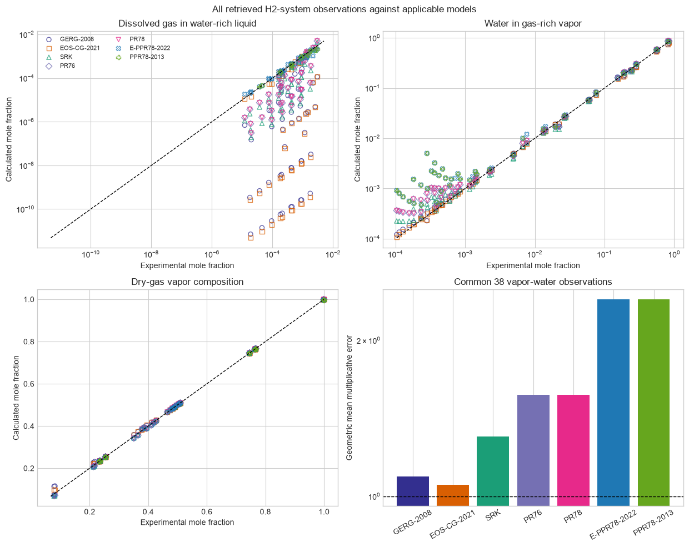
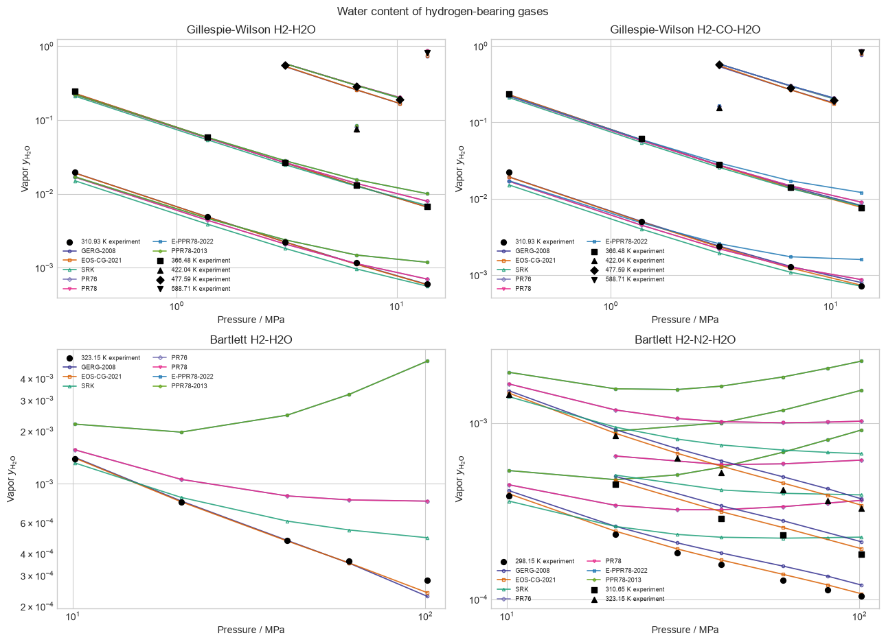

# Hydrogen-water systems across applicable models

This validation compares every applicable high-level `torch-flash` equation
of state with hydrogen-bearing water-content observations from Gillespie and
Wilson, *Gas Processors Association Research Report RR-41* (1980),
[OSTI 6782591](https://www.osti.gov/biblio/6782591), and E. P. Bartlett,
“The Concentration of Water Vapor in Compressed Hydrogen, Nitrogen and a
Mixture of These Gases in the Presence of Condensed Water,” *Journal of the
American Chemical Society* **49** (1927) 65–78,
[doi:10.1021/ja01400a010](https://doi.org/10.1021/ja01400a010).

The model suite now includes the global 40-group E-PPR78 revision of
J.-N. Jaubert, J.-W. Qian, S. Lasala, and R. Privat,
[doi:10.1016/j.fluid.2022.113456](https://doi.org/10.1016/j.fluid.2022.113456).
Its CCS scope follows X. Xu et al.,
[doi:10.1016/j.ijggc.2016.11.015](https://doi.org/10.1016/j.ijggc.2016.11.015);
the calculations use the later 2022 global coefficients, including the
available H2/CO/H2O group pairs.

## Composition parity

The study retains 53 measured states across H2–H2O, H2–CO–H2O, and
H2–N2–H2O. E-PPR78 covers all three systems; the earlier PPR78-2013
H2/N2/H2O submatrix covers 38 states because it has no carbon-monoxide group.
All 356 applicable model-state calculations converged, with a maximum
dimensionless fugacity residual of \(1.692\times10^{-9}\).

Across all 53 vapor-water observations, E-PPR78 has a 178.11% AARD and a
geometric mean multiplicative error of 1.962. On the 38 states shared with
PPR78-2013, both parameter revisions give the same water-content results
because the active H2/N2/H2O group coefficients are unchanged. EOS-CG-2021
has the smallest overall vapor-water deviation in this comparison, with
4.67% AARD and a geometric mean error factor of 1.048.

## Water-content pressure behavior

The pressure plots preserve every measured temperature branch and show the
physical water content rather than only an error statistic. E-PPR78 supplies
the additional predictive-cubic result for H2–CO–H2O. The conventional SRK,
PR76, and PR78 lines are zero-BIP baselines; they are not fitted aqueous
parameterizations. GERG-2008 and EOS-CG-2021 use their published mixture
terms.

The historical observations do not provide modern pointwise uncertainties.
The quantitative differences therefore describe this retrieved dataset and
should not be interpreted as uncertainty-weighted model rankings.
