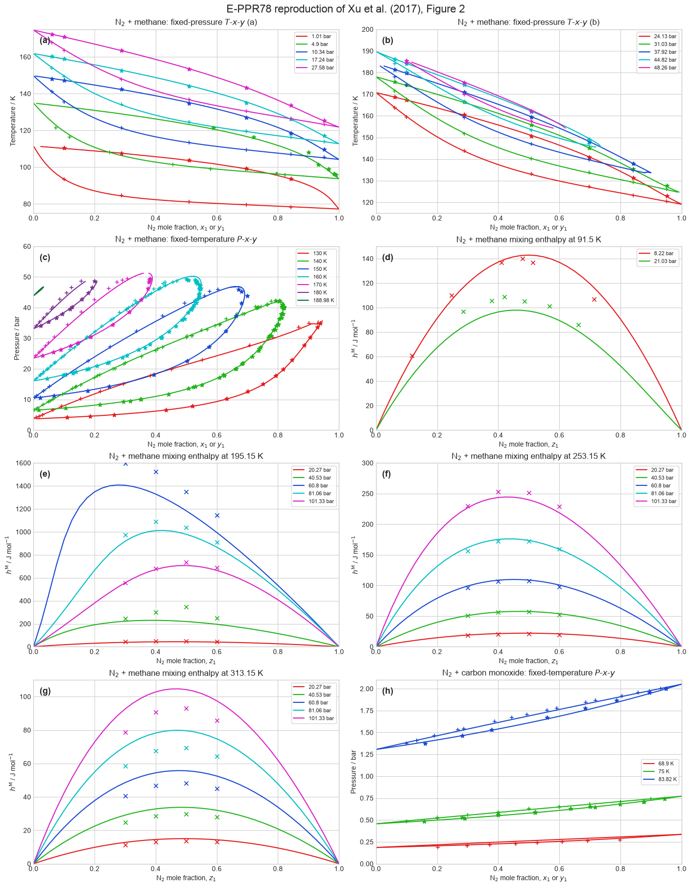
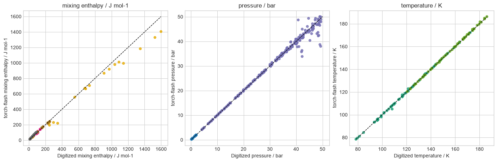

# E-PPR78 for CCS mixtures

This validation reproduces all eight panels of Figure 2 from X. Xu,
S. Lasala, R. Privat, and J.-N. Jaubert, “E-PPR78: a proper cubic EoS for
modelling fluids involved in the design and operation of carbon dioxide
capture and storage (CCS) processes,” *International Journal of Greenhouse
Gas Control* **56** (2017) 126–154,
[doi:10.1016/j.ijggc.2016.11.015](https://doi.org/10.1016/j.ijggc.2016.11.015).
The source figure covers N2–CH4 fixed-pressure and fixed-temperature phase
diagrams, N2–CH4 enthalpy changes on mixing, and N2–CO phase diagrams.

The experimental symbols were visually recovered from the publication's
vector artwork. Their coordinates were calibrated against the exact vector
axis borders of every subfigure; no underlying experimental table is
distributed here. Solid curves are fresh `torch-flash` calculations rather
than traced publication curves.

## Figure 2 reproduction

The calculations use the global 40-group E-PPR78 parameterization. Its active
N2–CH4 and N2–CO group pairs retain the 2017 coefficients. The resulting
interaction functions differ from the six-decimal \(k_{12}(T)\) labels in the
article by less than \(1.1\times10^{-4}\); the article reports the underlying
group coefficients to only two decimal MPa.

All retained phase-equilibrium states have a maximum dimensionless
fugacity residual below \(9.9\times10^{-9}\). Failed continuation attempts
near branch endpoints remain non-converged and are not replaced by
homogeneous \(x=y\) roots. With 41 points per continuation direction, the
complete eight-panel calculation took 31.8 s on one Apple CPU thread in
float64.

## Parity

The interpolated comparisons have 0.297 K temperature MAE, 0.528 bar pressure
MAE, and 21.9 J/mol mixing-enthalpy MAE. Their corresponding average absolute
relative deviations are 0.231%, 1.74%, and 8.87%. These values quantify the
visually recovered marker positions and should not be interpreted as a
replacement for the original experimental datasets or their uncertainties.

The study is calibration-domain validation because the displayed systems
contributed to E-PPR78 parameter estimation. It also verifies the implemented
temperature-dependent interactions, phase-boundary solvers, and
autodifferentiated mixing enthalpy against the defining publication.
