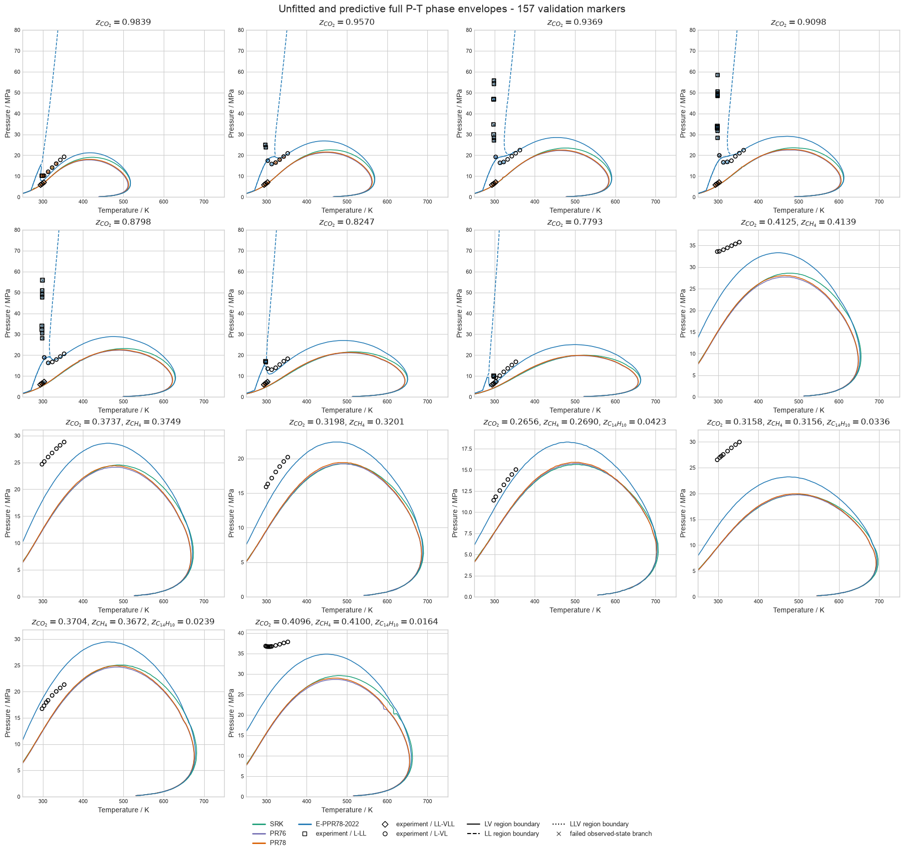
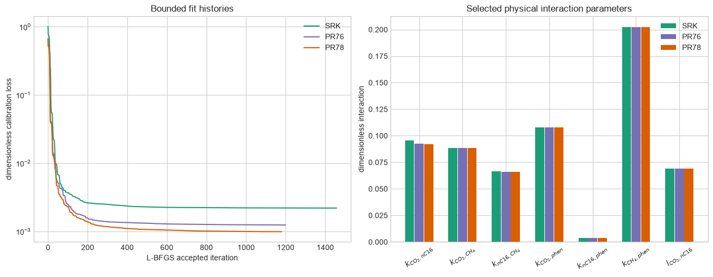
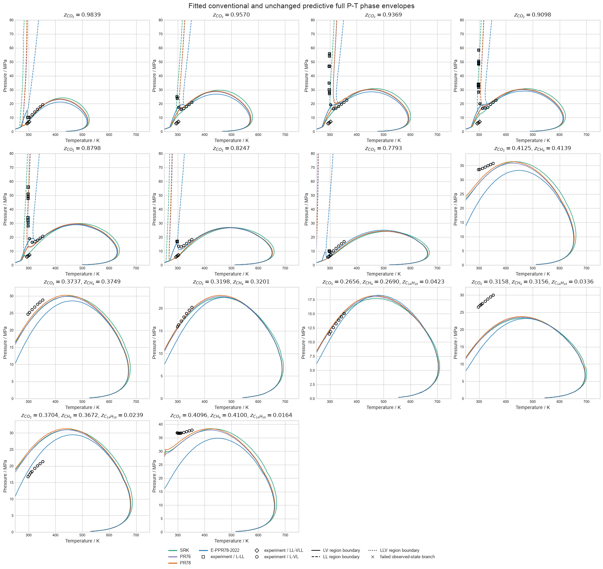
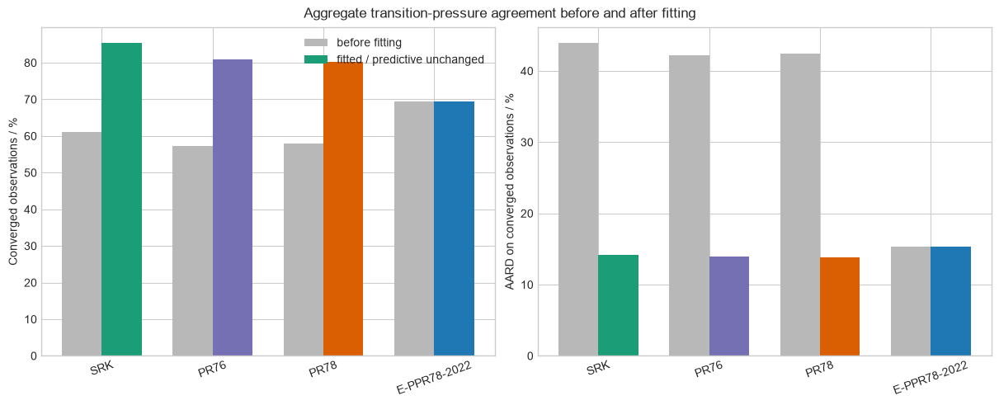

# CO2 pre-salt phase behavior across applicable models

This report compares every native `torch-flash` equation of state that covers
the CO2/n-hexadecane, CO2/n-hexadecane/methane, and
CO2/n-hexadecane/methane/phenanthrene systems measured by Simoncelli et al.,
*Fluid Phase Equilibria* **515** (2020) 112574,
[doi:10.1016/j.fluid.2020.112574](https://doi.org/10.1016/j.fluid.2020.112574).
The study contains all 157 observations from Tables 7–9: 37 liquid to
liquid-liquid (L-LL), 21 liquid-liquid to vapor-liquid-liquid (LL-VLL), and
99 liquid to vapor-liquid (L-VL) transitions.

The reported instrument uncertainties are 0.1 K and 0.05 MPa. They do not
represent composition, visual-transition, or model-form uncertainty.

## Model and evidence scope

SRK, PR76, PR78, and E-PPR78-2022 cover every component. The conventional
cubics use the paper's Table 3 pure-component constants and quadratic mixing.
Their unfitted baselines set every attraction and covolume interaction to zero.
E-PPR78 uses the global group-contribution correlation of Jaubert et al.,
[doi:10.1016/j.fluid.2022.113456](https://doi.org/10.1016/j.fluid.2022.113456),
and remains predictive.

GERG-2008 and EOS-CG-2021 omit n-hexadecane and phenanthrene. The bundled CPA
and activity/Huron-Vidal parameter sets do not cover the complete component
set. A consistent volume translation is not treated as a separate VLE model
because it leaves phase-equilibrium fugacity equalities unchanged.

Unfitted and predictive comparisons are experimental validation. Post-fit
agreement on the 136 two-phase observations is calibration evidence because
those observations enter the objective. The 21 LL-VLL states remain
experimental validation after fitting because they are excluded from parameter
estimation.

Three Table 7 labels give CO2 mole fractions 0.9838, 0.9370, and 0.9090,
whereas Table 2 and Figure 4 identify the same mixtures as 0.9839, 0.9369, and
0.9098. The repeated Table 2/Figure 4 identities are used here.

## Full phase-envelope calculation

Each curve is a boundary between equilibrium phase regions on a
fixed-composition \(P\)-\(T\) grid, not a polyline through transition
observations. `flash_grid` evaluates an 80 by 80 grid over 250–750 K and
0.2–80 MPa. `identify_grid_phases` labels the converged regions, and
`refine_flash_grid_phase_boundaries` re-flashes label-changing edges with four
batched bisection passes before reconnecting the boundary crossings.

Diamonds, squares, and circles are respectively the experimental LL-VLL,
L-LL, and L-VL observations from Simoncelli et al. Every one of the 157
reported transition states is plotted; the continuous curves are
`torch-flash` calculations and are not lines fitted through the markers.

Successful refinement passes target brackets no wider than approximately
0.40 K or 0.063 MPa. If a midpoint flash fails, the edge bracket is left
unchanged rather than assigning an unsupported phase label. The QA table
therefore reports both failed midpoint states and the largest retained
bracket.

| Phase-grid QA | Unfitted/predictive | Fitted conventional |
|---|---:|---:|
| Model-composition grids | 56 | 42 |
| Converged cells / total | 358,400 / 358,400 | 268,797 / 268,800 |
| Maximum fugacity residual | \(1.00\times10^{-8}\) | \(1.00\times10^{-8}\) |
| Maximum material-balance residual | \(1.49\times10^{-14}\) | \(1.41\times10^{-11}\) |
| High-temperature closure inside grid | 56 / 56 | 42 / 42 |
| Multiphase region below 80 MPa | 49 / 56 | 22 / 42 |
| Refined crossing edges | 12,008 | 10,040 |
| Failed midpoint states | 9 | 34 |
| Maximum retained temperature bracket / K | 0.791 | 3.165 |
| Maximum retained pressure bracket / MPa | 1.010 | 1.010 |

Curves beyond the measured 294–363 K interval are fluid-model extrapolations.
Solid phases are outside the calculation, so low-temperature fluid boundaries
can be metastable. Boundaries that reach 80 MPa are domain-truncated rather
than reported as physically closed.

## Part I: unfitted and predictive results

Coverage retains every observation in the denominator. AARD and RMSE use only
residual-converged, physically separated branches and must be read together
with coverage.

| Model | Converged / 157 | Coverage / % | AARD / % | RMSE / MPa |
|---|---:|---:|---:|---:|
| SRK, zero interactions | 96 | 61.15 | 43.91 | 11.25 |
| PR76, zero interactions | 90 | 57.32 | 42.23 | 11.26 |
| PR78, zero interactions | 91 | 57.96 | 42.39 | 11.21 |
| E-PPR78-2022, predictive | 109 | 69.43 | 15.31 | 5.64 |

| Model | Transition | Converged / total | Coverage / % | AARD / % | RMSE / MPa | Bias / MPa |
|---|---|---:|---:|---:|---:|---:|
| SRK | L-LL | 3 / 37 | 8.11 | 62.30 | 8.33 | -7.78 |
| SRK | L-VL | 93 / 99 | 93.94 | 43.31 | 11.33 | -10.02 |
| SRK | LL-VLL | 0 / 21 | 0.00 | — | — | — |
| PR76 | L-LL | 0 / 37 | 0.00 | — | — | — |
| PR76 | L-VL | 90 / 99 | 90.91 | 42.23 | 11.26 | -9.88 |
| PR76 | LL-VLL | 0 / 21 | 0.00 | — | — | — |
| PR78 | L-LL | 0 / 37 | 0.00 | — | — | — |
| PR78 | L-VL | 91 / 99 | 91.92 | 42.39 | 11.21 | -9.88 |
| PR78 | LL-VLL | 0 / 21 | 0.00 | — | — | — |
| E-PPR78-2022 | L-LL | 2 / 37 | 5.41 | 25.33 | 2.59 | -2.59 |
| E-PPR78-2022 | L-VL | 89 / 99 | 89.90 | 17.69 | 6.23 | -3.79 |
| E-PPR78-2022 | LL-VLL | 18 / 21 | 85.71 | 2.44 | 0.165 | -0.155 |

The zero-interaction results are model-form baselines, not recommended
reservoir-fluid parameterizations.

## Part II: simultaneous conventional-cubic calibration

One differentiable full-batch objective contains all 136 two-phase
observations simultaneously. At every optimizer evaluation, all observations
are evaluated at their measured temperature, pressure, and overall
composition. The objective uses the observed-state fugacity mismatch with
physically separated latent incipient compositions, plus a dimensionless
quadratic parameter-displacement penalty of 10 around the published Table 4
interaction vector.

The seven shared parameters are six symmetric attraction interactions and the
CO2/n-hexadecane covolume interaction. Attraction interactions are bounded to
\([-0.20, 0.35]\), and the covolume interaction to \([-0.15, 0.15]\), through
a differentiable bounded transform.

PyTorch L-BFGS uses a strong-Wolfe line search, an iteration budget of 2,000,
and 30 evaluated losses of no improvement as the early-stop patience. All
three fits met the numerical tolerance rather than exhausting the budget or
stopping on patience.

| Model | Accepted iterations | Initial loss | Selected iteration | Selected loss | Fit and sensitivity / s |
|---|---:|---:|---:|---:|---:|
| SRK | 1,457 | 1.012422 | 1,457 | 0.002200 | 43.51 |
| PR76 | 1,199 | 0.677006 | 1,199 | 0.001243 | 39.95 |
| PR78 | 1,179 | 0.650156 | 1,178 | 0.000992 | 40.10 |

| Interaction | SRK | PR76 | PR78 |
|---|---:|---:|---:|
| \(k_{\mathrm{CO2,nC16}}\) | 0.095644 | 0.092781 | 0.091973 |
| \(k_{\mathrm{CO2,CH4}}\) | 0.088373 | 0.088372 | 0.088370 |
| \(k_{\mathrm{nC16,CH4}}\) | 0.066277 | 0.066253 | 0.066224 |
| \(k_{\mathrm{CO2,phen}}\) | 0.108004 | 0.108010 | 0.108003 |
| \(k_{\mathrm{nC16,phen}}\) | 0.003897 | 0.003881 | 0.003891 |
| \(k_{\mathrm{CH4,phen}}\) | 0.202510 | 0.202513 | 0.202510 |
| \(l_{\mathrm{CO2,nC16}}\) | 0.068889 | 0.068837 | 0.068872 |

The local sensitivity audit contains 361 finite residual rows for each model.
All seven parameter directions have nonzero local singular values.

| Model | Local rank / 7 | Largest singular value | Smallest singular value | Condition number |
|---|---:|---:|---:|---:|
| SRK | 7 | 75.07 | 1.833 | 40.95 |
| PR76 | 7 | 82.18 | 1.881 | 43.70 |
| PR78 | 7 | 82.99 | 1.816 | 45.70 |

## Three-phase recovery

The LL-VLL states are binary three-phase invariants: fixed temperature gives
one equilibrium pressure and three phase compositions. Generic starts that
place one liquid near zero CO2 converge to a merged algebraic branch for this
CO2-rich system. The evaluator now includes physically separated,
all-CO2-rich invariant starts.

The fast path solves compatible invariant states in one PyTorch Newton batch.
For fitted conventional cubics, the selected branch is then polished or
recovered with the vectorized exact-Hessian trust-region method. The
restricted-step method follows Petitfrere and Nichita, *Fluid Phase
Equilibria* **362** (2014) 51–68,
[doi:10.1016/j.fluid.2013.08.039](https://doi.org/10.1016/j.fluid.2013.08.039).
Only the tiny dense Moré-Sorensen spectral subproblem is handled per state;
thermodynamic residual, gradient, and Hessian evaluations remain batched.

All 21 post-fit LL-VLL states converge for SRK, PR76, and PR78:

| Model | Converged / 21 | AARD / % | RMSE / MPa | Bias / MPa | Maximum fugacity residual |
|---|---:|---:|---:|---:|---:|
| SRK | 21 | 1.751 | 0.129 | -0.114 | \(2.86\times10^{-11}\) |
| PR76 | 21 | 2.098 | 0.149 | -0.136 | \(1.51\times10^{-10}\) |
| PR78 | 21 | 1.982 | 0.142 | -0.128 | \(1.49\times10^{-11}\) |

These are validation results because the LL-VLL observations were not used by
the fit.

## Fitted results

The same 157 Simoncelli et al. experimental markers are retained so that
before/after changes can be compared against identical observations. The
continuous E-PPR78 curve is unchanged because that predictive model was not
calibrated.

| Model | Status | Converged / 157 | Coverage / % | AARD / % | RMSE / MPa |
|---|---|---:|---:|---:|---:|
| SRK | fitted | 134 | 85.35 | 14.22 | 4.72 |
| PR76 | fitted | 127 | 80.89 | 13.92 | 4.46 |
| PR78 | fitted | 126 | 80.25 | 13.82 | 4.56 |
| E-PPR78-2022 | predictive, unchanged | 109 | 69.43 | 15.31 | 5.64 |

| Model | Transition | Converged / total | Coverage / % | AARD / % | RMSE / MPa | Bias / MPa |
|---|---|---:|---:|---:|---:|---:|
| SRK | L-LL | 15 / 37 | 40.54 | 22.49 | 8.34 | -0.76 |
| SRK | L-VL | 98 / 99 | 98.99 | 15.63 | 4.45 | -2.11 |
| SRK | LL-VLL | 21 / 21 | 100.00 | 1.75 | 0.129 | -0.114 |
| PR76 | L-LL | 10 / 37 | 27.03 | 23.67 | 8.63 | -0.17 |
| PR76 | L-VL | 96 / 99 | 96.97 | 15.49 | 4.31 | -1.20 |
| PR76 | LL-VLL | 21 / 21 | 100.00 | 2.10 | 0.149 | -0.136 |
| PR78 | L-LL | 10 / 37 | 27.03 | 24.87 | 9.44 | 3.19 |
| PR78 | L-VL | 95 / 99 | 95.96 | 15.27 | 4.27 | -0.81 |
| PR78 | LL-VLL | 21 / 21 | 100.00 | 1.98 | 0.142 | -0.128 |
| E-PPR78-2022 | L-LL | 2 / 37 | 5.41 | 25.33 | 2.59 | -2.59 |
| E-PPR78-2022 | L-VL | 89 / 99 | 89.90 | 17.69 | 6.23 | -3.79 |
| E-PPR78-2022 | LL-VLL | 18 / 21 | 85.71 | 2.44 | 0.165 | -0.155 |

The fitted two-phase rows are calibration-domain agreement, while the fitted
LL-VLL rows and every E-PPR78 row are validation evidence.

## PyTorch execution and performance

The run used float64 on CPU with four PyTorch intra-operation threads.
Transition states and grid states were grouped into compatible tensor batches.
The trust-region invariant solver likewise evaluates independent residuals,
gradients, and exact Hessian blocks in one tensor batch.

An isolated 40 by 40 PR78 phase-grid probe compared eager and compiled
execution with identical phase counts, convergence flags, and fugacity
residuals:

| Mode | Cold / s | Warmed median / s |
|---|---:|---:|
| Eager | 0.899 | 0.896 |
| `torch.compile` | 0.868 | 0.887 |

Compiled execution was not selected because the warmed improvement was below
the declared 5% threshold.

| Stage | Time / s |
|---|---:|
| Unfitted observation-state evaluation | 41.20 |
| Unfitted/predictive phase grids | 299.68 |
| Three fits and sensitivity audits | 123.56 |
| Fitted observation-state evaluation | 89.20 |
| Fitted conventional phase grids | 285.46 |
| Sum | 839.10 |

The phase grids remain the dominant cost. These timings include residual,
phase-separation, material-balance, and boundary-refinement checks and are not
comparable to a homogeneous-property call.

## Limitations

Accepted observation-state branches satisfy a maximum dimensionless
log-fugacity residual of \(10^{-7}\) and a minimum phase separation of
\(2\times10^{-3}\). Grid cells use a \(10^{-8}\) fugacity threshold. Solver
failure and phase collapse reduce coverage rather than being converted into
numerical errors.

Calibration substantially improves conventional-cubic aggregate agreement,
but L-LL branch coverage remains 27–41%. The full-rank local sensitivity
matrices are not a proof of global identifiability, parameter uniqueness, or
transfer outside the fitted systems. The broad phase-envelope domain includes
fluid-model extrapolation, and pressure-limited L-L branches must not be read
as closed curves.
