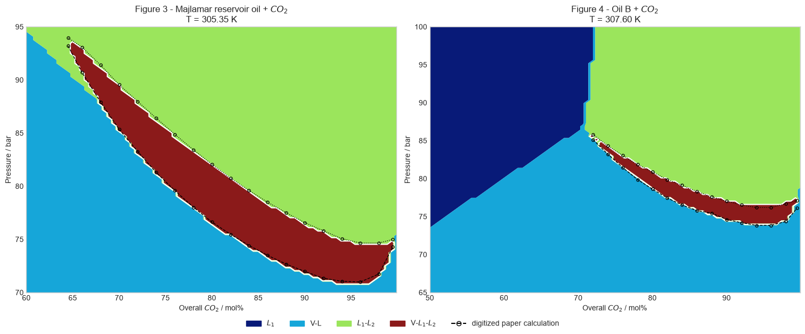
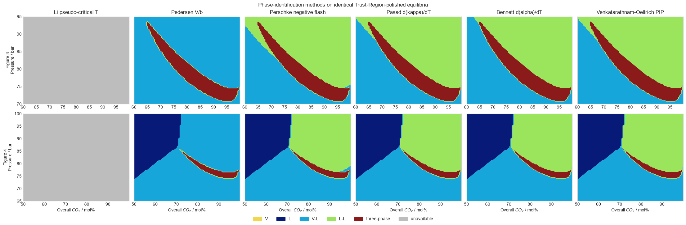

# Trust-Region phase envelopes and phase identification

**Evidence class: verification.** This report checks `torch-flash` against the
computed Peng-Robinson phase regions in Figures 3 and 4 of M. Petitfrere and
D. V. Nichita, “Robust and efficient Trust-Region based stability analysis
and multiphase flash calculations,” *Fluid Phase Equilibria* **362** (2014)
51–68,
[doi:10.1016/j.fluid.2013.08.039](https://doi.org/10.1016/j.fluid.2013.08.039).
The reference figures contain model calculations, not experimental
observations.

## Systems, model, and protocol

The two fixed-temperature \(P\)-\(z_{\mathrm{CO2}}\) systems are:

| Target | System | Temperature / K | Components | Grid |
|---|---|---:|---:|---:|
| Figure 3 | CO2 + Majlamar reservoir oil | 305.35 | 11 | 81 by 81 |
| Figure 4 | CO2 + Oil B | 307.60 | 16 | 81 by 81 |

The component properties, oil compositions, and nonzero binary interaction
coefficients are the complete Tables 4 and 5 of Z. Li and A. Firoozabadi,
“General strategy for stability testing and phase-split calculation in two
and three phases,” *SPE Journal* **17** (2012) 1096–1107,
[doi:10.2118/129844-PA](https://doi.org/10.2118/129844-PA). The supporting
paper spells the field “Maljamar”; the target Figure 3 caption uses
“Majlamar.” Unlisted interactions are zero.

The model is Peng-Robinson with the Robinson-Peng 1978 high-acentric-factor
extension for the heavy pseudo-components. `flash_grid` independently
discovers one, two, or three phases at each state.
`polish_grid_equilibrium_with_trust_region` then applies:

- the modified tangent-plane-distance Trust-Region objective to one-phase
  states; and
- the improved mole-number Gibbs objective of Petitfrere and Nichita,
  equations (8)–(15), to two- and three-phase states.

States of the same phase count are evaluated in PyTorch batches with
independent exact Hessian blocks. The calculation uses float64 on CPU with
four PyTorch threads, a Trust-Region residual tolerance of \(10^{-8}\), a
material-balance tolerance of \(5\times10^{-11}\), at most 100 Trust-Region
iterations, and a Trust-Region batch chunk of 128 states.

## Phase-envelope reproduction

Colors are `torch-flash` equilibrium regions. Open markers and dashed/dotted
lines are raster digitizations of the published calculations, not
experimental data. The displayed identity map uses the
Venkatarathnam-Oellrich phase-identification parameter; phase count and the
three-phase boundaries do not depend on that labeling choice.

The Majlamar three-phase region is fully immersed between the V–L1 and L1–L2
regions and closes near two bicritical points. Oil B reproduces the
single-phase L1 wedge, the V–L1 and L1–L2 regions, the narrow three-phase
ribbon, and its CO2-rich bicritical termination.

| Target | Boundary | Digitized points | MAE / bar | Maximum error / bar |
|---|---|---:|---:|---:|
| Figure 3 | lower | 19 | 0.139 | 0.700 |
| Figure 3 | upper | 19 | 0.343 | 0.530 |
| Figure 4 | lower | 15 | 0.310 | 0.703 |
| Figure 4 | upper | 15 | 0.221 | 0.401 |

The comparison includes the finite pressure spacing of the 81-point grid and
the uncertainty of raster digitization. All four mean absolute errors remain
below 0.35 bar and all maximum errors remain below 0.71 bar.

## Solver diagnostics

| Diagnostic | Figure 3 | Figure 4 |
|---|---:|---:|
| States | 6,561 | 6,561 |
| One / two / three phases | 0 / 5,580 / 981 | 1,588 / 4,759 / 214 |
| Phase-discovery failures | 0 | 0 |
| Trust-Region phase-count corrections | 0 | 18 |
| Trust-Region attempts / failures | 6,561 / 0 | 6,561 / 0 |
| Maximum Trust-Region iterations | 0 | 1 |
| Maximum log-fugacity residual | \(9.998\times10^{-9}\) | \(9.986\times10^{-9}\) |
| Maximum material-balance residual | \(1.110\times10^{-16}\) | \(1.110\times10^{-16}\) |
| Phase discovery / s | 57.53 | 47.48 |
| Trust-Region audit / s | 11.41 | 19.27 |

The zero-iteration maximum for Figure 3 means the independently discovered
states already satisfy the Trust-Region stationarity tolerance; their exact
gradients and Hessians are still evaluated. For Figure 4, negative converged
TPD minima correct 18 nominally one-phase seeds to physical two-phase states.

## Comparison of phase-identification methods

Physical phase identification is a post-flash diagnostic. It changes the
names assigned to converged compositions, not the equilibrium phase count,
fugacity equalities, or material balance.

Petitfrere and Nichita do not define a separate scalar phase-identification
criterion. Li and Firoozabadi define the figure labels only: V is vapor, L1 is
the CO2-lean liquid, and L2 is the CO2-rich liquid. Their selection of the
higher-molar-mass phase elsewhere in the supporting paper is a stability-test
initialization rule, not a phase-identification method. No Nichita-named
criterion is therefore inferred.

All six methods exposed by `identify_grid_phases` were attempted on the same
Trust-Region-polished equilibria:

| Method | Fig. 3 available / % | Fig. 3 agreement with PIP / % | Fig. 4 available / % | Fig. 4 agreement with PIP / % |
|---|---:|---:|---:|---:|
| Li pseudo-critical temperature | 0.0 | — | 0.0 | — |
| Pedersen \(V/b\) | 100.0 | 51.4 | 100.0 | 66.7 |
| Perschke negative flash | 100.0 | 97.8 | 100.0 | 99.7 |
| Pasad \(d\kappa/dT\) | 100.0 | 100.0 | 100.0 | 100.0 |
| Bennett \(d\alpha/dT\) | 100.0 | 98.7 | 100.0 | 100.0 |
| Venkatarathnam-Oellrich PIP | 100.0 | 100.0 | 100.0 | 100.0 |

Li's criterion requires critical molar volumes that are absent from the
published Tables 4 and 5. It remains explicitly unavailable rather than
silently estimating missing inputs. Pedersen \(V/b=1.75\) classifies every
two-phase state as vapor-liquid in these dense CO2-rich systems. The two
response-derivative criteria and PIP recover the connected liquid-liquid
region; Pasad and PIP agree on every grid cell in both systems.

The ambiguity bands contain 25 active phase slots for PIP in Figure 3 and
none in Figure 4. Such ambiguity is retained as a diagnostic instead of
changing a phase count or smoothing the categorical map.

## Conclusion and limitations

`torch-flash` reproduces the two published phase-envelope topologies and all
digitized three-phase boundaries within the declared one-bar mean and two-bar
maximum gates. Every one of the 13,122 states passes phase discovery and the
batched exact-Hessian Trust-Region audit.

This is verification of equations and numerical behavior for the published
Peng-Robinson parameter sets. It is not experimental validation. The
Trust-Region calculation is local: independent phase-count discovery and
stability diagnostics remain necessary, particularly near coalescing
bicritical phases. Phase-identification agreement is also not proof of a
physical label; the criteria use different diagnostics and can disagree in
dense supercritical regions.
