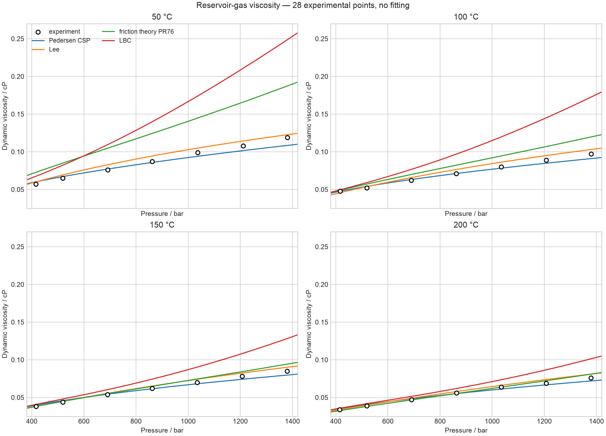
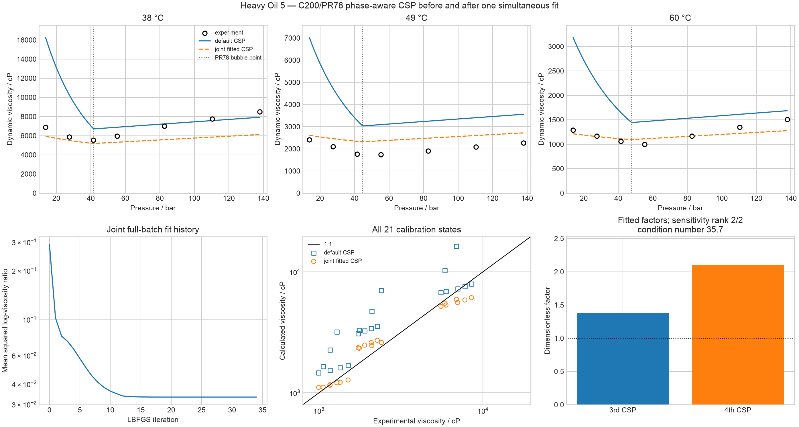
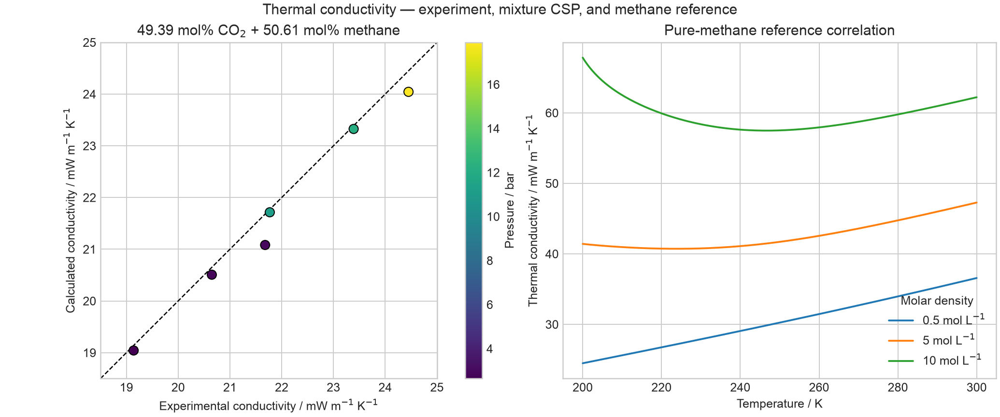
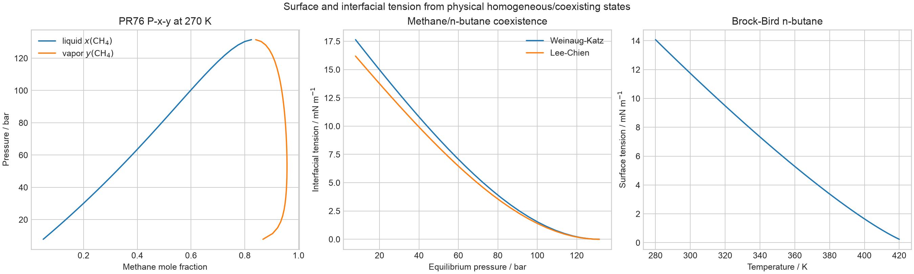
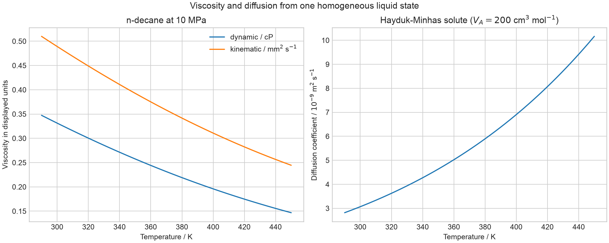

# Transport properties

**Evidence class: validation, calibration, and application.** This report
compares `torch-flash` viscosity and thermal-conductivity predictions with
three real petroleum-fluid datasets and demonstrates the
surface/interfacial-tension and liquid-diffusion APIs on physically resolved
states. The reservoir-gas and thermal-conductivity curves are predictive. The
Heavy Oil 5 figure distinguishes the default prediction from a simultaneous
two-parameter calibration to all displayed heavy-oil observations.

The implementation follows K. S. Pedersen, P. L. Christensen, and
J. A. Shaikh, *Phase Behavior of Petroleum Reservoir Fluids*, 3rd ed. (2024),
chapter 10,
[doi:10.1201/9780429457418](https://doi.org/10.1201/9780429457418), with
the primary model papers cited below. Calculations use float64 on CPU and SI
API inputs; axes show conventional petroleum units after explicit
conversion.

## Reservoir-gas viscosity

The validation fluid contains eight named light components and fourteen
measured C7-C20+ cuts. The plotted 28 measurements cover 50-200 °C and
415-1381 bar and were reported by Kashefi et al.,
[doi:10.1016/j.petrol.2013.10.021](https://doi.org/10.1016/j.petrol.2013.10.021).
Measured heavy-cut masses and densities are mapped to PR properties before
the four viscosity routes are evaluated.

Pedersen corresponding states gives the lowest aggregate error at 3.62% MAPE,
followed by Lee-Gonzalez-Eakin at 5.02%. The published one-parameter PR76
friction-theory form gives 16.16% MAPE, and untuned LBC gives 34.61%. The
corresponding-states formulation is from Pedersen et al.,
[doi:10.1016/0009-2509(84)87009-8](https://doi.org/10.1016/0009-2509%2884%2987009-8);
LBC is from Lohrenz, Bray, and Clark,
[doi:10.2118/915-PA](https://doi.org/10.2118/915-PA); and the friction model
is the one-parameter form of Quiñones-Cisneros, Zéberg-Mikkelsen, and Stenby,
[doi:10.1016/S0378-3812(00)00474-X](https://doi.org/10.1016/S0378-3812%2800%2900474-X).

## Heavy-oil viscosity

Heavy Oil 5 uses the measured whole C7+ mass and standard density from
Pedersen Tables 10.8-10.9. The C7+ fraction is expanded through C200 with the
Pedersen-Milter-Sørensen heavy-aromatic parameter set: C7-C9 remain
individual fractions and C10-C200 are reduced to nine approximately
equal-weight pseudocomponents. The phase model is PR78 with the published
polar-component interactions. A bubble point is solved once at each
temperature; all sub-bubble states at that temperature are then flashed in
one batch, and the viscosity correlation receives the equilibrium liquid
composition. This phase preparation converged at every displayed state with
a maximum log-fugacity residual below \(10^{-8}\).

The solid curve is the source-parameter prediction with both dimensionless
CSP factors equal to one. The dashed curve is a joint calibration of the
third and fourth CSP factors to all 21 observations at 38, 49, and 60 °C. The
full-batch objective is the mean squared logarithmic viscosity ratio. Bounded
PyTorch LBFGS stopped by the loss tolerance after 34 iterations, below the
200-iteration limit and with 30-iterate no-improvement patience.

The PR78 source-factor prediction gives 63.74% MAPE. The simultaneous fit
selects a third CSP factor of 1.38412 and a fourth CSP factor of 2.10535,
reducing MAPE to 15.57% while retaining the low-pressure upturn and the
temperature-dependent curve shapes. The log-viscosity sensitivity matrix is
full rank \(2/2\), with condition number 35.7. This is calibration evidence
only: there is no Heavy Oil 5 holdout, and visible state-dependent deviations
remain.

The heavy-oil viscosity formulation is from Lindeloff et al., *The
Corresponding States Viscosity Model Applied to Heavy Oil Systems*,
*J. Can. Pet. Technol.* 43 (2004), 47-53. The C200 PR characterization is
from Pedersen, Milter, and Sørensen,
[doi:10.2118/88364-PA](https://doi.org/10.2118/88364-PA).

## CO2/methane thermal conductivity

The six homogeneous-gas measurements contain 49.39 mol% CO2 and 50.61 mol%
methane. They originate with Christensen and Fredenslund,
[doi:10.1021/je60083a034](https://doi.org/10.1021/je60083a034). The mixture
model maps each state to the Hanley methane reference correlation; the
right-hand panel separately exposes the complete pure-methane model at three
molar densities. The methane correlation is defined by Hanley, McCarty, and
Haynes,
[doi:10.1016/0011-2275(75)90010-7](https://doi.org/10.1016/0011-2275%2875%2990010-7).

The Christensen-Fredenslund mixture prediction gives 1.02% MAPE and a 2.76%
maximum absolute deviation over the six experimental states. No mixture
conductivity parameter is adjusted.

## Surface and interfacial tension

The application first solves a PR76 methane/n-butane \(P\)-\(x\)-\(y\)
isotherm at 270 K. Of 33 attempted continuation points, 32 pass the
equilibrium-residual, phase-separation, and liquid-volume-below-vapor-volume
gates; their maximum fugacity residual is \(7.61\times10^{-9}\).
Weinaug-Katz and Lee-Chien then receive the same coexisting compositions and
molar densities. Brock-Bird is evaluated independently for subcritical
n-butane; its defining source is
[doi:10.1002/aic.690010208](https://doi.org/10.1002/aic.690010208).

Both gas-oil interfacial models decrease smoothly toward zero as the phase
compositions coalesce. The Brock-Bird curve also decreases toward the
n-butane critical temperature. These are application checks of physical
trend and API orchestration, not comparisons with interfacial-tension
measurements.

## Kinematic viscosity and n-paraffin diffusion

The final application uses PR78 liquid density and LBC dynamic viscosity for
n-decane at 10 MPa. Kinematic viscosity is the direct SI ratio
\(\nu=\eta/\rho\). Hayduk-Minhas uses the same bulk viscosity together with an
explicit illustrative n-paraffin solute normal-boiling molar volume of
200 cm³/mol. The infinite-dilution correlation is defined by Hayduk and
Minhas,
[doi:10.1002/cjce.5450600213](https://doi.org/10.1002/cjce.5450600213).

Dynamic and kinematic viscosity decrease smoothly from 290 to 450 K, while
the calculated diffusion coefficient increases. Every displayed value is
finite and positive. The diffusion curve is an application of the stated
solute descriptor, not an experimental n-decane self-diffusion validation.

## Conclusion and limitations

The experimental evidence supports the Pedersen corresponding-states
viscosity for the selected reservoir gas and the Christensen-Fredenslund
thermal-conductivity model for the selected CO2/methane gas. For Heavy Oil 5,
the default heavy-oil factors remain substantially biased, while one joint
two-factor calibration captures the pressure and temperature trends with a
15.57% MAPE. This result does not establish transferability to another oil.
LBC and the published one-parameter PR76 friction model show larger
model-form deviations in the dense reservoir-gas case.

Transport correlations consume a specified homogeneous state or an already
resolved pair of coexisting phases; they do not perform stability analysis,
flash calculations, or phase identification. Their empirical validity
ranges, required critical volumes or component parameters, and phase-root
selection remain part of the scientific configuration.
